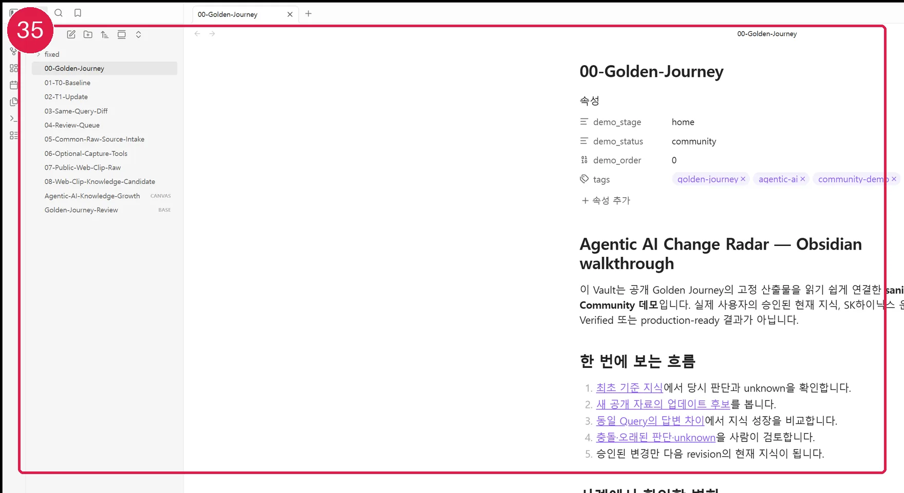

# BoI Wiki Local

BoI Wiki Local은 사용자의 업무 설명을 **BoI Wiki를 잘 쓰기 위한 Harness**로 구성하고, 개인 지식을 Local Private에서 안전하게 축적한 뒤 검토된 조직 지식으로 연결하는 **Production-grade 품질 목표의 Meta Harness Candidate**입니다. 실제 외부 검증이 끝나기 전에는 production-ready를 주장하지 않습니다.

별도 서비스나 Python 프로그램이 아닙니다. 비개발자도 Codex·Claude 같은 AI에게 자연어로 요청하면, 저장소의 Harness와 Skill을 사용해 역할·작업 흐름·산출물·검토 기준을 구성할 수 있습니다.

## 가장 쉬운 시작

| 선택 | 가능한 작업 | 추가 설치 |
|---|---|---|
| Local only | 공통 원본 수집·지식 정제·Query·Review | 없음 |
| + Obsidian | Golden Journey·Backlinks·Bases·Canvas 탐색 | Obsidian |
| + MCP | 권한 범위의 공유 BoI Wiki 조회 | MCP client 연결 |
| 둘 다 | Local 지식 탐색과 공유 Wiki 조회 | Obsidian + MCP |

AI에게 원하는 문장을 그대로 전달합니다.

```text
이 저장소를 설치하고 Second Brain을 설정해줘.
```

```text
Obsidian으로 Golden Journey를 안전하게 열어줘.
```

```text
QuickAdd와 Web Clipper 설치 preview를 보여줘.
```

```text
BoI Wiki MCP를 현재 AI 클라이언트에 연결해줘.
```



[Obsidian Golden Journey 전체 화면과 사용법](templates/second-brain-guide/32-obsidian-golden-journey.md)

Windows 설치 후에는 `C:\Users\<내계정>\Projects\boi-wiki-local` clone 자체를 Codex·Claude의 작업 폴더로 엽니다. WSL 사본이나 다른 폴더에서 시작한 작업에는 Windows clone의 project Skill이 자동으로 나타나지 않으므로, Skill을 전역 복사하지 말고 Windows clone을 새 작업으로 연 뒤 같은 자연어 요청을 전달합니다.

## 1. BoI Wiki Local은 무엇인가

```text
업무 설명
→ 기존 BoI Skill 확인과 조합
→ 역할·작업 흐름·산출물 계약 구성
→ Local Private에서 실행·검토
→ OKF 0.1 + BoI Profile 검증
→ 공유 가치가 있는 결과만 promotion 후보
→ 사용자 승인 후 지원되는 원격 등록
```

- `boi-wiki-local`: 개인 PC의 Local Private 작업 공간과 BoI Wiki 호환 경계
- `boi-wiki`: 검토된 Team/Public 조직 지식과 principal·ACL·revision·review의 최종 책임 시스템
- Python·평가 스크립트: 관리자·CI 검증 자산이며 일반 사용자 요구사항이 아님

## 2. 한 문장으로 Harness 구성

AI에게 다음 문장을 그대로 전달합니다.

> 내가 하는 업무를 설명할게. 이 업무에서 좋은 지식을 만들고 BoI Wiki에 축적할 수 있도록 역할, Skill, 작업 흐름, 검토 기준을 포함한 Harness를 구성해줘.

AI는 업무 목표와 성공 조건을 확인하고, 기존 Skill을 우선 재사용한 뒤 Local/Remote 경계와 검토 단계를 포함한 Harness를 제안합니다. 별도 창이나 터미널을 사용자가 직접 열 필요는 없습니다.

## 3. Meta Harness가 만드는 것

Core Meta Harness인 `boi-harness-builder`는 다음 계약을 만듭니다.

1. 사용자가 그대로 전달할 한 문장 요청
2. 대상 업무와 성공 조건
3. 재사용할 기존 BoI Skills
4. 역할과 책임, 독립 reviewer
5. dependency DAG와 Single·Reduced·Full 실행 모드
6. 입력·중간·최종 산출물 계약
7. 오류·누락·모호한 요청의 fallback
8. Local/Remote 경계와 promotion 가능한 결과
9. OKF·BoI·보안·품질 검증 체크리스트
10. 비개발자용 walkthrough
11. 실제 실패를 Case·orchestration·범용 Skill 중 가장 작은 책임 계층으로 환류하는 Harness evolution 기록
12. 다음 AI 세션에서 그대로 불러 실행할 Local Harness 카드와 재사용 요청문

도메인 지식과 합성 자료는 Case에 둡니다. 기존 범용 Skill 조합으로 해결할 수 있으면 새 도메인 Skill을 만들지 않습니다.

승인된 개인 Harness는 대화 속 설계로 끝내지 않고 `data/boi/private/<Local Profile ID>/notes/harnesses/<이름>.md`에 OKF 0.1 + BoI Profile 0.1-local 문서로 보존합니다. 이후에는 “저장된 `<이름>` Harness로 이번 자료를 처리해줘”라고 요청하면 같은 역할·DAG·산출물·검토 계약을 다시 사용합니다. 이 실행에는 새 Skill, Python 프로그램, 백그라운드 서비스가 필요하지 않습니다.

Meta Harness는 `Audit → Frame → Skill·지식 흐름 설계 → 역할·DAG → Local/Remote 계약 → Build → Validate → Evolve` 순환을 사용합니다. 실제 사용 실패는 fixture 정답에 맞추는 수정이 아니라 소유 계층을 판정한 뒤 최소 범위로 환류합니다.

자세한 구조는 [Core·Flagship·Case·Admin 계층 지도](templates/second-brain-guide/01-meta-harness-map.md)를 참고합니다.

비개발자 실행 순서는 [내 업무용 BoI Harness 만들기](templates/second-brain-guide/02-build-your-harness.md)에서 그대로 따라 할 수 있습니다.

## 4. Flagship: Second Brain

Second Brain은 부가 예제가 아니라 개인 지식을 장기 자산으로 바꾸는 **가장 중요한 Flagship Harness**입니다. 다만 Meta Harness 전체를 대체하거나 모든 사용자에게 강제되지는 않습니다.

AI에게 다음 문장을 그대로 전달합니다.

> 이 저장소를 내 BoI Wiki Local Second Brain으로 설정해줘. 대화와 자료 폴더에서 오래 쓸 지식을 정리하고, 공유할 가치가 있는 내용만 BoI Wiki promotion 후보로 만들어줘. 원격 자동 업로드는 하지 마.

```text
대화·메일·웹·문서·자료 폴더
→ Local Private 원본·출처 보존
→ 기존 지식 검색
→ 보강·교정·충돌 보류·신규 판단
→ 실제 재사용 가능한 지식
→ Query·Lint·Review
→ 공유 가치 판단
→ OKF·BoI promotion 후보
→ 사용자 승인
```

읽을 수 있는 자료를 단순 등록 문서로만 감싸지 않습니다. 같은 작업에서 주장·결정·제약·불확실성·반증·검토 상태를 실제로 재사용 가능한 지식으로 정리합니다. 원시 대화 transcript는 기본 저장하지 않고, 중복 자료는 새 문서를 만들지 않으며, 교정은 이전 이력을 보존합니다.

시작: [AI에게 설치 맡기기](templates/second-brain-guide/12-ai-assisted-setup.md) · [Second Brain 전체 사례](cases/flagship/second-brain/CASE.md)

지식 업데이트를 실제 공개 사례로 따라 하려면 [지식 변화 운영과 사용자 프롬프트 가이드](templates/second-brain-guide/38-knowledge-change-operations.md)와 [Agentic AI Change Radar Golden Journey](cases/research/agentic-ai-change-radar/CASE.md)를 함께 봅니다.

공통 원본 폴더에 웹 클립, 문서, 메일, 표와 이미지를 함께 넣어 정리하려면 다음 요청을 사용합니다. Web Clipper도 같은 폴더의 `web-clip` 유형이며 전용 inbox를 만들지 않습니다.

```text
내가 지정한 원본 자료 폴더를 새 AI 세션이 시작될 때 확인해줘.
웹 클립, 문서, 메일, 표와 이미지를 원문 그대로 보존하고,
새 자료만 OKF + BoI Profile 지식 후보와 review queue로 정리해.
승인 전에는 현재 지식이나 원격 Wiki에 반영하지 마.
```

```text
방금 원본 자료 폴더에 넣은 새 자료만 처리해줘.
이전에 같은 SHA256으로 처리한 자료는 건너뛰고, 원문과 지식 후보를 분리해줘.
```

```text
방금 저장한 웹 클립만 처리해줘.
같은 SHA256으로 이미 반영된 자료는 건너뛰고 원문은 변경하지 마.
```

```text
지난 세션 이후 추가된 원본과 처리 대기·실패·검토 항목을 자료 유형별로 보여줘.
```

## 5. Local 지식에서 조직 지식으로

Local Private 원문은 BoI Wiki에 자동 적재되지 않습니다.

```text
Local Private 지식
→ 일반 knowledge·context pack·SOP로 정제
→ 민감정보·출처·공개 범위 검증
→ canonical OKF 0.1 + BoI Profile 0.1 후보
→ reviewer·scope·exact hash 미리보기
→ 사용자 승인
→ 원격 등록 기능이 지원될 때만 등록
```

`agent-memory`, capture, evidence, hypothesis, analysis log는 직접 promotion할 수 없습니다. Local 경로·Local ID·원문은 sanitized remote projection에서 제거하며 owner와 ACL은 인증된 원격 principal을 기준으로 정합니다.

## 6. OKF·BoI Wiki 호환 계약

모든 Profile 대상 Local Markdown은 다음 핵심 계약을 유지합니다.

```yaml
okf_version: "0.1"
boi_profile_version: "0.1-local"
visibility: local-private
local_only: true
promotion_status: local_only
```

promotion compiler 경계에서만 `boi_profile_version: "0.1"`과 `team` 또는 `public` 후보로 변환합니다. Team은 `team_id`, reviewer, 구조화된 `source_refs`가 필요하고 Public은 공개 출처와 민감정보 검사를 추가로 통과해야 합니다. 실제 대상 BoI Wiki validator가 확인되지 않으면 호환 완료를 주장하지 않습니다.

## 7. 선택 기능: Obsidian과 MCP

`MCP 설치해줘` 또는 `BoI Wiki MCP 연결해줘`라고 자연어로 요청하면 AI가 먼저 저장소 source를 판정하고, 저장소에 고정된 MCP connection descriptor로 Codex·Claude 설정 preview를 만듭니다. 사내 Bitbucket은 실제 읽기 성공 때 우선하며 DNS·라우팅·연결 실패일 때만 GitHub로 fallback합니다. 사내 호스트의 인증·저장소 권한 실패는 fallback하지 않습니다. Git source와 MCP endpoint는 별도 계약이며 endpoint는 `BOI_WIKI_MCP_EXTERNAL_URL`, 승인된 배포 descriptor 또는 사용자가 준 주소에서만 선택합니다. 설정 적용과 재시작 뒤 `initialize`·`tools/list`까지 확인해야 연결 완료이며, endpoint·인증·필수 도구가 없으면 `pending-external-system`으로 남깁니다.

두 저장소를 함께 검증하는 관리자·CI는 `scripts/check-repository-source-contract.ps1 -PeerRoot <boi-wiki 경로>`로 공통 manifest, selector, MCP connector와 descriptor의 SHA256 일치를 확인합니다. 일반 사용자는 이 명령을 직접 실행하지 않습니다.

| 구성 | 하는 일 | 하지 않는 일 |
|---|---|---|
| 둘 다 없음 | Local 작성·검색·정리·review·promotion preview | 사내 Wiki 조회·원격 등록 |
| Obsidian | Properties·Backlinks·Graph·Bases·Canvas로 Markdown 탐색 | Graph 선을 원천 관계로 확정 |
| MCP 조회 연결 | 권한 범위의 BoI Wiki 검색·인용 | Local Private 자동 업로드 |
| promotion 기능 | canonical 후보 검증과 미리보기 | 승인 전 submit |

Obsidian은 선택형 Markdown 보기 도구이며 플러그인은 필수가 아닙니다. MCP 없음·Obsidian 없음·Python 없음 환경에서도 핵심 여정이 동작해야 합니다.

## 8. Flagship과 Global Insight Case

`cases/`는 Meta Harness 자체가 아니라 Meta Harness로 만든 실사례 모음입니다. 제품의 횡단 기반은 **범용 Second Brain 하나만 Flagship 후보로 유지**하고, 사용자가 명시적으로 승인한 Global Insight 공개 Case 세 개를 Community 상태로 제공합니다.

- [Flagship Second Brain](cases/flagship/second-brain/CASE.md)
- [SK하이닉스 Agentic AI Change Radar](cases/research/agentic-ai-change-radar/CASE.md) — 첫 Golden Journey
- [FAB Logistics Digital Twin](cases/strategy/fab-logistics-digital-twin/CASE.md) — 전략 Case
- [Scientific Foundation Model Knowledge](cases/strategy/scientific-foundation-model-knowledge/CASE.md) — 장기 지식 Case

세 Global Insight Case는 공개 1차 자료의 확인 범위와 SHA256을 고정한 source record, runtime-neutral 역할·DAG, 실패·resume와 frozen evaluation protocol을 포함합니다. 실제 runtime 반복과 비개발자 Acceptance 전에는 Verified·Reference를 주장하지 않습니다. 세 Case가 있다는 사실만으로 새 generic Skill을 만들지 않으며 stable operation과 baseline 개선이 검증된 뒤에만 승격을 검토합니다.

일곱 자연어 도구와 Python-free 계약: [SK하이닉스 Global Insight Meta Harness](templates/global-insight/README.md)

구현 evidence와 아직 남은 외부 gate: [Global Insight implementation status](research/global-insight-implementation-status.md)

요구사항별 완료 감사: [Global Insight acceptance audit](research/global-insight-acceptance-audit.md)

## 9. 관리자 검증 evidence

평가 인프라는 제품을 증명하는 관리자·CI 계층이며 사용자 여정의 주인공이 아닙니다. 현재 보존된 공식 evidence는 Second Brain Codex p01~p07 repetition 1의 with-Harness/baseline 14회와 7개 blind comparison입니다. p08과 repetition 2·3은 동결했고, Claude·비개발자 Acceptance·실제 BoI Wiki validator·사내 Bitbucket은 현재 내부 작업의 blocker가 아닌 `pending external gate`입니다.

- [Second Brain BENCHMARK](cases/flagship/second-brain/evals/BENCHMARK.md)
- [Case 카탈로그와 상태](cases/README.md)

현재 어떤 Case도 `reference` 또는 `production-ready`를 주장하지 않습니다. pending external gate가 끝나기 전까지 `second_brain_reference_ready`, `cross_runtime_eval_ready`, `non_developer_acceptance_ready`, `boi_contract_ready`, `full_release_ready`는 모두 `false`입니다. 이 gate들은 Meta Harness Core와 Second Brain 내부 후보 산출물의 사용·개선을 중단시키지 않습니다.
