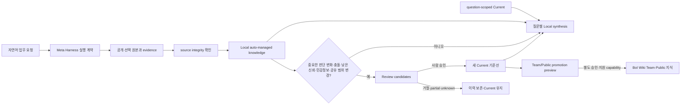

# Meta Harness × Second Brain × BoI Wiki — 세 Golden Journey

이 문서는 세 요소의 역할을 분리하면서 하나의 사용자 경험으로 연결한다.

- **Meta Harness Factory**는 반복 업무를 역할, 순서, artifact, review, 실패·재개와 안전 경계가 있는 실행 계약으로 만든다.
- **Second Brain**은 실행 결과를 현재 지식, 변화 후보, 이력과 재사용 가능한 Query로 축적한다.
- **BoI Wiki**는 승인된 지식 중 조직이 재사용할 부분만 ACL·revision·review가 있는 공유 지식으로 받는다.

## Governed knowledge-growth 계약

아래 다섯 축은 서로 다른 상태다. `source integrity`는 원본과 확인 범위, `Local auto-managed knowledge`는 해시가 확인되어 Local 검색에 바로 쓸 수 있는 지식, `question-scoped Current`는 특정 질문 또는 판단에 승인된 기준선, `Review candidates`는 중요한 변화만 모은 사람 검토 대상, `Team/Public promotion`은 별도 미리보기와 승인이 필요한 공유 경계다.

- `observed`와 충돌 없는 `inferred`는 만들어진 방식이지 문서별 승인 대기 상태가 아니다. `inferred does not mean pending`.
- 예를 들어 33 auto-curated sources는 해시·중복·범위 확인 뒤 Local 검색에 쓰이며, `not document-level Review items`이다. Review는 문서 수가 아니라 중요한 판단 변화에만 생긴다.
- 후보는 사람이 승인하기 전 `never overwrites Current before human approval`이다. Current가 없더라도 Local 종합은 명확히 표시해 답할 수 있지만, 승인된 Current 답변이라고 부르지 않는다.
- 신규 unique hash가 없으면 `no-change`이며 보고서·문서·index·log·Current를 만들거나 바꾸지 않는다. 같은 SHA256의 추가 경로는 이미 반영된 provenance로만 기록한다.
- Team/Public promotion은 Local 지식의 자동 후속 단계가 아니다. 검토된 안전한 후보의 exact preview와 별도 승인이 모두 있어야 한다.

## 세 사례

| Golden Journey | 반복 업무 | Second Brain 성장 evidence | 현재 상태 | BoI Wiki 경계 |
|---|---|---|---|---|
| [AI Radar](research/agentic-ai-change-radar/CASE.md) | 최신 Agentic·Physical AI 신호를 원 출처로 검증 | 승인 revision 1과 아직 이 저장소에 공개되지 않은 revision 2 review 후보, 9 delta, 동일 Query 비교 | Community, revision 2 미승인 | 승인된 atomic claim만 public/team preview 가능 |
| [FAB Logistics Digital Twin](strategy/fab-logistics-digital-twin/CASE.md) | GEM300·Digital Twin·ontology를 안전한 pilot 가설로 연결 | [baseline에서 AAS·OPC UA·action governance 후보로 성장](strategy/fab-logistics-digital-twin/knowledge-growth/2026-08-08-01/index.md) | Community, domain review 없음 | concept map과 검증 전제만 가능; 표준 원문·내부 수치·Action 차단 |
| [Scientific Foundation Model](strategy/scientific-foundation-model-knowledge/CASE.md) | 논문의 법칙·가정·prediction·재현 상태를 장기 추적 | [baseline에서 물리 제약 위치·scope·artifact/reproduction 분리로 성장](strategy/scientific-foundation-model-knowledge/knowledge-growth/2026-08-08-01/index.md) | Community, 독립 재현 없음 | 검토된 atomic claim과 verification state만 가능; 논문·dataset 복제 차단 |

## 모든 Case가 지켜야 할 한 계약

1. 현재 snapshot과 마지막 검토일을 먼저 고정한다.
2. discovery signal과 claim evidence를 분리한다.
3. 원 출처의 실제 확인 범위와 SHA256 또는 hash 제한 사유를 기록한다.
4. evidence, counterevidence, contradiction과 unknown을 함께 보존한다.
5. 기존 atomic claim과 비교해 실제 판단이 바뀐 delta만 남긴다.
6. source-first reviewer가 producer 요약이 아니라 원 출처에서 다시 시작한다.
7. 동일 Query의 현재·후보 답변 차이가 delta와 일치해야 한다.
8. 승인 전에는 current revision을 바꾸지 않는다.
9. no-change·거절·partial·blocked·unknown은 실행 이력만 남긴다.
10. raw source·evidence·개인 Harness·agent memory는 직접 promotion하지 않는다.
11. 일반 `observed`와 충돌 없는 `inferred` 지식을 문서별 Review로 막지 않는다. Review는 중요한 판단 변화와 안전·공유 경계에만 사용한다.

## 범용성 판단

세 사례에서 공통으로 재사용된 것은 source manifest, atomic claim, delta, review queue, fixed Query, hash invalidation, resume와 promotion boundary다. 도메인별로 달라진 것은 source policy, 검토 질문과 허용 가능한 결론이다. 따라서 현재 evidence는 **하나의 범용 Meta Harness 계약이 서로 다른 지식 수명주기를 지원할 수 있다는 Community 수준 사례**다.

아직 다음을 증명하지 않았다.

- Codex·Claude 간 반복 benchmark와 blind comparison
- 두 명 이상의 비개발자 Acceptance
- Digital Twin domain expert review와 실제 FAB data validation
- Scientific claim의 독립 재현
- 실제 BoI Wiki endpoint의 validate·submit round trip

이 gate 전에는 Verified, Reference 또는 production-ready라고 부르지 않는다.
