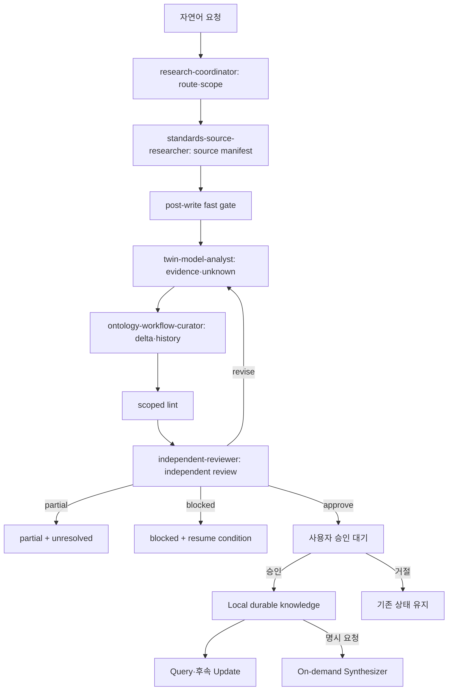

# Orchestrator — FAB Logistics Digital Twin

## Dependency DAG

## Phase exit

각 phase는 input/output exact SHA256, supported claims, counterevidence, unknown, contradiction, blocker와 다음 진입 조건을 handoff에 기록합니다. source hash와 source manifest hash가 바뀌면 dependent artifact와 승인은 무효입니다.

## Scale modes

- Full: 역할을 독립 실행하고 reviewer는 모든 handoff 뒤에 실행합니다.
- Reduced: creator와 Independent Reviewer로 축소합니다.
- Single-agent: 역할별 순차 pass를 수행하고 reviewer pass에서 source부터 다시 읽습니다.
- No-team fallback: agent-team 없이 같은 파일, exit criteria와 handoff로 순차 실행합니다.

어떤 모드도 artifact나 안전 계약을 줄이지 않습니다.

## Failure, retry and resume

- source 접근 실패는 source별 한 번만 재시도합니다.
- 필수 source가 없으면 blocked, 비필수면 partial입니다.
- contradiction은 양쪽을 보존하고 review queue에 둡니다.
- reviewer 실패는 한 번 재시도한 뒤 blocked이며 producer self-approval은 없습니다.
- 입력 hash가 같을 때만 마지막 검증 checkpoint부터 resume합니다.
- 새 자료나 변화가 없으면 빈 change set으로 정상 종료합니다.
