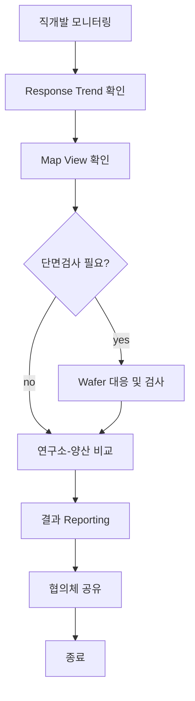
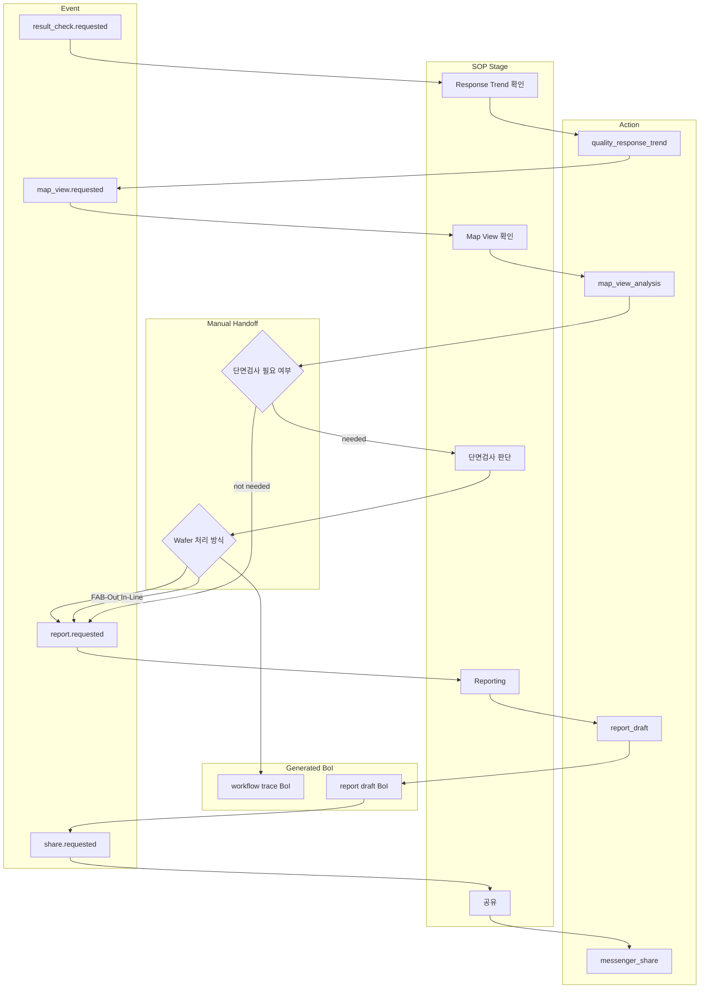
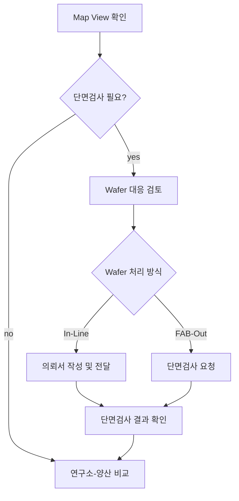

# Summary

직개발 결과 확인 및 Reporting SOP를 한 장짜리 복잡한 그림으로만 표현하지 않고, 빠른 이해용 Overview와 추적 가능한 Swimlane으로 나눈 Mermaid 초안이다. 긴 시스템명과 담당 방식은 node 안에 모두 넣지 않고 Source Mapping 표로 분리한다.

# Overview Mermaid

# Swimlane Mermaid

# Stage Detail Mermaid

# Source Mapping

| Node ID | Kind | Label | Source |
|---|---|---|---|
| `evt_result` | event | result_check.requested | SOP draft stage 1 |
| `stage_trend` | stage | Response Trend 확인 | SOP draft stage 1 |
| `stage_map` | stage | Map View 확인 | SOP draft stage 2 |
| `manual_section` | manual decision | 단면검사 필요 여부 | SOP draft stage 3 |
| `manual_wafer` | manual decision | Wafer 처리 방식 | SOP draft stage 4/6 |
| `act_report` | action | report_draft | SOP draft stage 8 |
| `act_share` | action | messenger_share | SOP draft stage 9 |

# Stage Notes

- stage 번호 5와 6은 원본 이미지의 배치 순서를 보존하되, 실행 흐름은 `단면검사 요청 -> 결과 확인`으로 해석한다.
- 품질 시스템, Map 분석 시스템, 단면 검사 시스템, 메신저는 candidate connector다.
- 사람이 판단해야 하는 node는 decision/manual node로 남긴다.

# Diagram QA

| Check | Status |
|---|---|
| Mermaid fenced block | pass |
| Overview node count <= 10 | pass |
| Swimlane separates Event, Stage, Action, Manual, BoI | pass |
| Decision edges have labels | pass |
| Source Mapping includes every important node kind | pass |
| No legacy non-numeric private path | pass |

# Citations

- [Direct development reporting SOP draft](../sop-drafts/direct-development-reporting-sop-draft.md)
