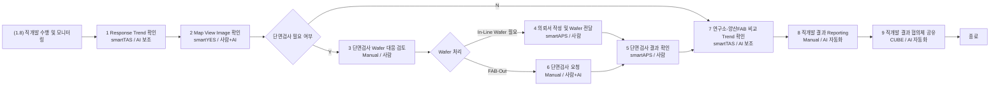

# Mermaid

# Notes

- stage 번호 5와 6은 원본 이미지의 배치 순서를 보존하되, 실행 흐름은 `단면검사 요청 -> 결과 확인`으로 해석한다.
- smartTAS, smartYES, smartAPS, CUBE는 candidate connector다.
- 사람이 판단해야 하는 node는 decision/manual node로 남긴다.
