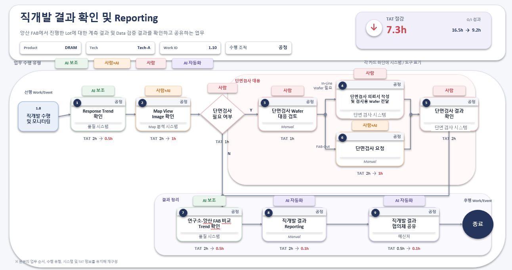

# Summary

이 폴더는 사용자가 agent에게 자연어로 요청했을 때 어떤 local BoI 산출물이 생기고, shared BoI Wiki runtime에서는 Event, Action, Langflow, generated BoI가 어떻게 연결되는지 보여주는 PoC 예제 세트다.

원본 SOP 이미지는 아래 파일로 고정한다.

# Examples

| 요청 | 실행 성격 | 예제 문서 | 생성 산출물 |
|---|---|---|---|
| 이 회의 내용을 BoI로 정리해줘. | local | [Meeting to BoI](meeting-to-boi.md) | [sample-meeting-to-boi.md](../../notes/sample-meeting-to-boi.md) |
| 이 SOP 이미지를 BoI Wiki 형식으로 초안 만들어줘. | local + evidence | [SOP Image to Draft](image-to-sop-draft.md) | [direct-development-reporting-sop-draft.md](../../sop-drafts/direct-development-reporting-sop-draft.md) |
| 직개발 결과 확인 SOP를 Mermaid 프로세스 플로우로 그려줘. | local | [SOP Mermaid Flow](sop-mermaid-flow.md) | [direct-development-reporting-mermaid.md](../../diagrams/direct-development-reporting-mermaid.md) |
| 이 이벤트가 발생하면 어떤 SOP와 Action이 이어지는지 알려줘. | live workflow evidence | [Event to Action Plan](event-to-action-plan.md) | [direct-development-reporting-event-to-action-plan.md](../../event-drafts/direct-development-reporting-event-to-action-plan.md) |
| 기존 API 문서를 BoI Action Spec 초안으로 만들어줘. | local | [API Doc to Action Spec](api-doc-to-action-spec.md) | [quality-system-response-trend-action-draft.md](../../action-drafts/quality-system-response-trend-action-draft.md) |
| 현장에서 말하는 Response Trend 용어를 dictionary에 추가해줘. | local | [Dictionary Term Authoring](dictionary-term-authoring.md) | [response-trend.md](../../dictionary/response-trend.md) |
| 원격 BoI Wiki를 검색해서 이번 업무용 context pack을 만들어줘. | remote lookup optional | [Remote Context Pack](remote-context-pack.md) | [direct-development-reporting-context-pack.md](../../context-packs/direct-development-reporting-context-pack.md) |
| 만들어진 SOP 내용 괜찮네. Public으로 공유해줘. | approval required | [Public Promotion](promotion-public.md) | [direct-development-reporting-public-promotion-draft.md](../../promotion-drafts/direct-development-reporting-public-promotion-draft.md) |
| 팀 주간보고 작성한 거 괜찮아 보이네. 팀 주간보고로 올려줘. | approval required | [Weekly Report Promotion](weekly-report-promotion.md) | [sample-weekly-report-team-promotion-draft.md](../../promotion-drafts/sample-weekly-report-team-promotion-draft.md) |
| 오래된 Private BoI 정리 후보 보여줘. | local | [Archive Candidates](archive-candidates.md) | [archive-cleanup-candidates.md](../../reports/archive-cleanup-candidates.md) |
| MCP 설정은 모르겠으니 local만 써줘. | local-only | [Local Only Mode](local-only-mode.md) | [local-only-runbook.md](../../workflow-simulations/local-only-runbook.md) |

# Runtime Evidence

Shared BoI Wiki runtime smoke는 `scripts/run_direct_development_sop_poc.py`로 실행된 trace `trace-f91b32904db0434db27c3f84307103ad`를 근거로 한다. 이 trace는 `direct_development.result_check.requested.v1`부터 `direct_development.share.requested.v1`까지의 event chain, `BoI Universal Action Simulator Flow` 기반 `SIMULATED` Langflow actions, generated Private BoI, `manual_required`, `approval_required` evidence를 모두 포함한다.

# Real vs Simulated

- Real local output: 이 repo 안의 Markdown 산출물과 `sop_sample_image.png`.
- Real shared runtime evidence: shared `boi-wiki`에서 실행한 Event/Action/Langflow smoke trace.
- SIMULATED: 품질 시스템, Map 분석 시스템, 단면 검사 시스템, 메신저 action은 실제 시스템 호출이 아니라 `BoI Universal Action Simulator Flow`로 생성한 PoC evidence다.
- Approval required: Public/Team promotion과 high-risk action invoke는 preview/preflight까지만 자동화하고, 최종 게시나 실행은 사용자 승인 후 진행한다.
- Dictionary: 현장 용어는 먼저 local dictionary로 명확히 만들고, shared MCP가 있으면 private -> team -> public 우선순위로 기존 정의를 확인한다.
