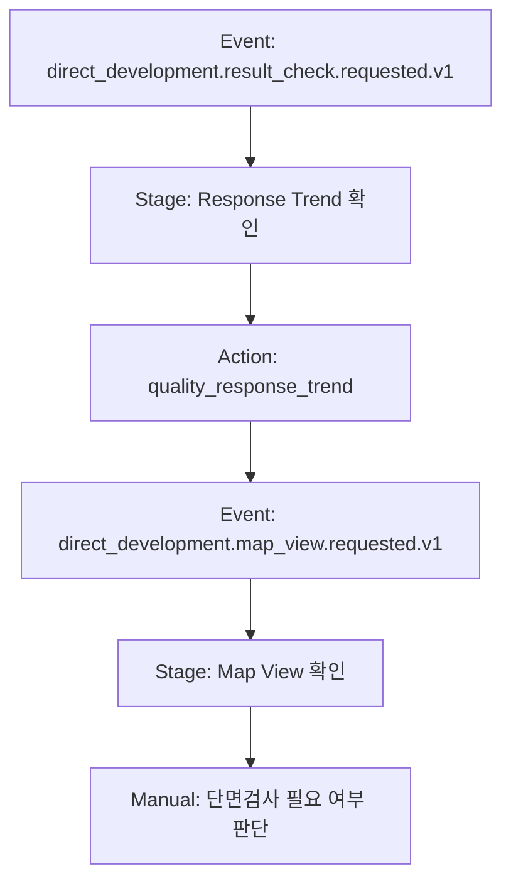

# Prompt

```text
직개발 결과 확인 SOP를 BoI Wiki 형식으로 읽고, 각 단계가 보이도록 Mermaid 프로세스 플로우로 그려줘. MCP가 연결되어 있으면 원격 BoI Wiki에서 direct-development SOP와 Action을 찾아서 반영하고, 없으면 내가 제공한 SOP 텍스트만으로 local 초안을 만들어줘.
```

# Expected Agent Behavior

1. `boi-sop-flow-visualizer` skill을 사용한다.
2. SOP stage, event type, automated action, manual handoff를 추출한다.
3. Overview Mermaid와 Swimlane Mermaid를 기본으로 만들고, 10개 node를 넘는 복잡한 구간은 Stage Detail Mermaid로 분리한다.
4. `data/boi/private/0000000/diagrams/`에 Mermaid 문서를 저장한다.
5. Source Mapping과 Diagram QA를 포함한다.
6. 공유는 사용자가 별도 승인하기 전까지 하지 않는다.

# Output Example



긴 설명, 시스템명, 담당자, simulation 여부는 node label이 아니라 Source Mapping 표에 분리한다.

# Citations

- Skill: `boi-sop-flow-visualizer`
