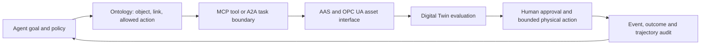

# Agentic AI와 Physical AI의 연결

## 재사용 가능한 연결 claim

| ID | 연결 판단 | 변화 | 근거 수준 |
|---|---|---|---|
| C-K01 | Digital Twin은 physical agent의 실패를 실제 설비 전에 재현하는 evaluation environment가 될 수 있다. | 신규 | review-required |
| C-K02 | ontology는 agent가 읽는 world state와 허용된 action을 같은 업무 언어로 묶는 contract 후보다. | 강화 | review-required |
| C-K03 | memory·event history·설비 상태는 같은 event time, version과 source provenance로 정합성을 유지해야 한다. | 신규 | unknown |
| C-K04 | MCP·A2A와 OpenUSD·AAS·OPC UA는 서로 다른 층이므로 protocol bridge만으로 의미·권한·안전이 완성되지 않는다. | 신규 | corroborated |

## 연결 구조

이 그림은 구현 완료 상태가 아니라 검증 순서를 나타낸다.

## 반드시 분리할 것

- MCP server가 tool을 노출한다는 사실과 그 action이 설비에 안전하다는 판단
- A2A agent가 메시지를 교환한다는 사실과 두 agent가 같은 제조 의미를 공유한다는 판단
- ontology가 action을 모델링한다는 사실과 실제 권한 집행이 검증됐다는 판단
- Digital Twin에서 성공한 trajectory와 실제 설비에서 성공한 trajectory
- event history가 저장됐다는 사실과 시각·revision·원 출처가 일치한다는 판단

## 실험 가설

공개 자료로 제안할 수 있는 최소 가설은 “ontology로 제한한 action contract를 Digital Twin에서 trajectory-level로 평가한 뒤 사람 승인을 거쳐 제한된 physical action으로 승격하면, 단순 prompt 기반 tool agent보다 감사와 복구가 쉬워진다”이다. 실제 효과와 비용은 unknown이다.

