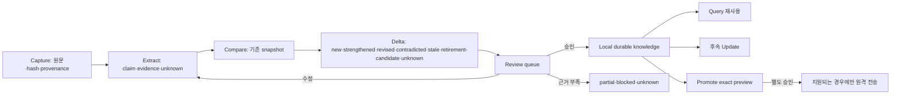

# SK하이닉스 Global Insight Meta Harness

이 디렉터리는 공개 자료를 반복적으로 축적하고 기존 판단의 변화를 보존하기 위한 runtime-neutral 실행 계약입니다. 별도 검색 엔진이나 전역 Skill을 만들지 않으며, 기존 `OKF 0.1 + BoI Profile 0.1-local` 문서와 Case artifact를 사용합니다.

## 한 문장으로 시작

```text
이번 주 Agentic AI에서 바뀐 내용만 기존 Global Insight 지식과 비교해 반영 후보로 보여줘. 보고서는 만들지 말고 변경 세트와 검토 목록만 만들어줘.
```

## 사용자 도구

| 표시 이름 | 내부 식별자 | 기본 결과 | 자동으로 하지 않는 일 |
|---|---|---|---|
| Capture | `capture` | immutable source record와 source manifest | claim 확정, 원격 전송 |
| Update | `update` | change set과 review queue | 변화가 없을 때 보고서 생성 |
| Query | `query` | 현재 Local 지식에 근거한 답과 `unknown` | 외부 조사 자동 실행 |
| DeepResearch | `deep-research` | 승인 범위의 source manifest, evidence, delta preview | 별도 엔진 구축, 무승인 조사·반영 |
| Health | `health` | provenance·link·stale·overdue·hash finding | 의미적 결론 자동 수정 |
| Review | `review` | 사람의 유지·수정·partial·blocked 결정 패키지 | producer self-approval |
| Promote | `promote` | sanitized exact preview, reviewer, target scope, SHA256 | 승인 전 전송 |

사용자-facing 이름은 정확히 `DeepResearch`입니다. 다른 별칭을 사용자 도구명으로 만들지 않습니다.

## 자연어 라우팅

- “이 URL을 Global Insight에 보관하고 기존 주제와 연결해줘.” → Capture
- “이번 주 Agentic AI에서 바뀐 내용만 반영해줘.” → Update
- “현재까지 정리된 Agent Memory 방식을 비교해줘.” → Query
- “최신 공식 자료까지 새로 조사해서 기존 판단을 갱신해줘.” → DeepResearch
- “현재 지식에서 오래되거나 충돌하는 내용을 찾아줘.” → Health
- “이 충돌 주장을 검토하고 유지할 결론을 보여줘.” → Review
- “이 내용을 조직에 공유할 수 있는 후보로 만들어줘.” → Promote

필수 정보가 모호하면 목적, 범위, 원하는 결과에 관한 쉬운 질문을 최대 세 개만 묻습니다.

## 지식 수명주기



원문과 evidence는 불변입니다. 정제 지식을 바꿀 때는 이전 snapshot과 변경 근거를 남깁니다. `stale`은 거짓이나 폐기가 아니라 재검토가 필요하다는 뜻입니다.

## 기본 결과

주간 실행은 보고서를 만들지 않습니다. 다음 중 실제로 해당하는 항목만 생성합니다.

- change set: `new`, `strengthened`, `revised`, `contradicted`, `stale`, `retirement-candidate`, `unknown`
- review queue와 다음 검토일
- Query 답변
- DeepResearch preview
- Health findings
- Review decision
- promotion preview

임원 브리프, 기술 비교표, 전략·파일럿 제안, 상세 보고서, 발표 자료는 명시적인 주문이 있을 때만 On-demand Synthesizer pass에서 생성합니다.

## 실행 모드

| 모드 | 역할 투영 | 독립 검토 |
|---|---|---|
| Full | 수집·분석·변경·검토 역할을 분리 | 별도 reviewer |
| Reduced | creator + reviewer | reviewer 분리 |
| Single-agent | 역할별 순차 pass | reviewer pass에서 manifest와 원문부터 다시 읽음 |
| No-team fallback | 동일 파일·DAG·handoff로 순차 실행 | Single-agent와 같은 검토 분리 |

입력, artifact, 안전, approval 계약은 모드에 따라 바뀌지 않습니다. 고위험 claim은 Single-agent 검토를 통과해도 사람 Review 대상입니다.

## 검증 경계

- Post-write fast gate: 해당 artifact의 필수 Profile 필드, enum, source hash, 원문 불변성, provenance, Local Private 경계, 직접 promotion 금지 타입, 이번 실행 링크, placeholder와 metadata-only wrapper를 기계적으로 검사합니다.
- Post-Update scoped lint: 변경 문서, 직접 연결 주제, 영향 claim, index·navigation, 새 contradiction과 stale downstream만 검사합니다.
- Health: 전체 또는 관심 주제의 구조적 상태를 찾지만 의미를 수정하지 않습니다.
- Review: contradiction, 중요 claim, unknown, DeepResearch 결론과 promotion 후보를 사람이 판정합니다.
- Verify와 Audit: 사용자가 명시한 깊이 검증 또는 전체 의미 감사입니다.

Python·qmd·Obsidian·MCP·agent-team은 optional입니다. 일반 경로는 agent의 파일 읽기·검색·SHA256과 Windows PowerShell만으로 동작합니다. Python 도구는 관리자·CI oracle과 benchmark에만 사용합니다.

## 파일 안내

- [runtime-contract.json](runtime-contract.json): 일곱 도구, delta, artifact, scale mode와 안전 기본값의 기계 판독 가능한 계약
- [artifact-contract.md](artifact-contract.md): 입력·manifest·evidence·delta·handoff·failure·promotion 계약
- [harness-card-template.md](harness-card-template.md): 실제 7자리 Local Profile에 생성할 개인 Harness card 본문
- [native-fast-gate.md](native-fast-gate.md): Python-free 검사 범위와 명령 없는 사용자 경험
- [examples/](examples/): 빈 Update, evidence, handoff, failure·resume, hash invalidation, scoped lint와 promotion preview의 결정론적 native 검사 artifact
