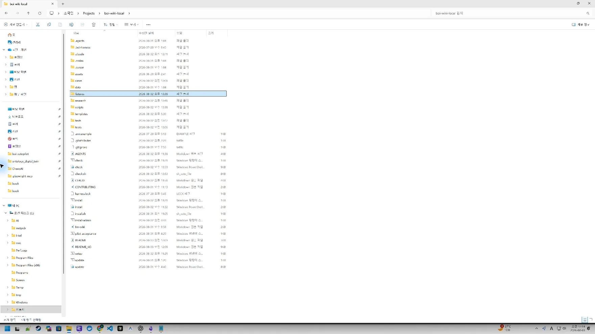

# Windows·Git 저장소 설치

대상은 처음 설치하는 Windows 사용자입니다. 예상 시간은 10분이며 Git for Windows, 배포 Git 저장소 접근 권한, 숫자 7자리 Local Profile 식별자가 필요합니다. 일반 사용자에게 Python은 필요하지 않습니다. 외부에서는 GitHub 기준 저장소를 사용하고, 사내에서는 같은 commit을 Bitbucket에 반입한 뒤 URL만 바꿉니다. `0000000`은 예제 전용입니다.



[화면 01을 원본 크기로 열기](_media/01-explorer-repository.webp)

주소 표시줄이 `C:\Users\<내계정>\Projects\boi-wiki-local`을 가리키고 목록에 `setup.cmd`, `AGENTS.md`, `.agents`, `.boi-harness`가 함께 보이면 올바른 Windows clone입니다. 파일 확장명 숨김 설정에서는 `setup.cmd`가 `setup`으로 보일 수 있습니다.

## 가장 쉬운 방법: 에이전트에게 요청

Codex 같은 로컬 작업 에이전트에서 저장소 URL을 제공하고 다음을 그대로 전달합니다.

```text
Windows 네이티브 C:\Users\<내계정>\Projects\boi-wiki-local에
{{repository_url}} 저장소를 clone하고 내 BoI Wiki Local Second Brain으로 설정해줘.
Harness를 먼저 검증하고 설치 preview를 보여줘. 기존 문서, .env, .obsidian,
Local Private 파일은 덮어쓰거나 원격으로 보내지 마. 내 확인 후 apply하고 Windows 기본 설치 결과를 확인해줘.
설치 후에는 그 Windows clone 자체가 현재 AI 작업 폴더인지 확인해줘. 다른 폴더나
WSL 사본에서 시작했다면 Skill을 전역 복사하지 말고 내가 열어야 할 Windows 경로를 알려줘.
```

에이전트는 Harness 검증, Windows 작업 폴더 확인, 환경 진단, 사번 확인, 변경 미리보기, 적용, 최종 검증 순서로 진행해야 합니다. 정상 작업 폴더에는 Codex용 `AGENTS.md`·`.agents/skills/`와 Claude용 `CLAUDE.md`·`.claude/skills/`가 같은 저장소 안에 있습니다. 설치기는 양쪽의 Core Skill 세 개가 모두 존재하고 비어 있지 않으며 같은 내용을 갖는지 파일을 만들기 전에 확인합니다.

Codex·Claude 작업이 WSL 사본이나 다른 폴더에서 시작됐다면 설치 완료와 Skill 활성화는 같은 뜻이 아닙니다. AI가 폴더를 자동 전환할 수 없는 환경에서는 새 작업에서 `C:\Users\<내계정>\Projects\boi-wiki-local`을 열고 설정 요청을 다시 전달합니다. WSL 사본에 Windows 변경을 복사하거나 project Skill을 사용자 전역 폴더에 설치하지 않습니다.

## 직접 설치

PowerShell에서 실행합니다. 회사 표준 인증 도구로 Git 인증을 처리하고 PAT·비밀번호·SSH private key를 저장소나 `.env`에 기록하지 않습니다.

```powershell
New-Item -ItemType Directory -Force "$env:USERPROFILE\Projects" | Out-Null
Set-Location "$env:USERPROFILE\Projects"
git clone {{repository_url}} boi-wiki-local
Set-Location .\boi-wiki-local
.\setup.cmd
```

설치기가 숫자 7자리 Local Profile 식별자, 자동 정리 방식, 선택 자료 폴더를 차례로 묻습니다. 이어서 생성될 파일과 Local/Remote 경계가 보이는 요약을 확인하고 `Y`, `예` 또는 `네`로 승인합니다. 일반 사용자는 별도 환경변수나 설정 파일을 다룰 필요가 없습니다.

이전 배포판의 `install.cmd` 또는 `install.ps1`을 실행해도 같은 설정 절차로 연결됩니다. 새 안내와 화면에서는 혼동을 줄이기 위해 `setup.cmd`만 사용합니다.

이미 clone했다면 `origin`이 현재 배포 저장소를 가리키는지 확인합니다. 외부 검증은 GitHub로 수행하며 사내 전환은 다음 한 줄만 다릅니다.

```powershell
git remote set-url origin <사내 Bitbucket URL>
git remote -v
```

설치·update 스크립트는 provider 이름을 사용하지 않고 현재 `origin`을 읽습니다. URL에 PAT·비밀번호를 포함하지 않습니다.

```powershell
git remote -v
```

설치기는 선택한 사번을 Git에서 제외된 `.env`에 저장합니다. 이후 새 PowerShell 창에서도 그 Profile을 자동으로 찾으며, 기존 파일은 덮어쓰지 않고 새로 만들 항목과 충돌 항목을 구분합니다.

## 정상 결과와 실패 시 이동

- `data/boi/private/{사번}/`: 개인 Local Private 영역
- `notes/capture-inbox/`: 수정하지 않는 수집 원문
- `notes/knowledge/`: 원문에서 정제한 지식
- `notes/harnesses/`: 승인된 개인 Harness 카드
- `notes/guide/`: 지금 읽고 있는 Wiki형 가이드
- 기존 BoI 초안, 보고서, promotion 디렉터리

설정 시작 전에 `harness.lock`과 오프라인 Harness 스냅샷의 release·checksum·signature가 일치하고, Windows clone의 Codex·Claude용 Core Skill 세 개가 각각 존재하며 비어 있지 않고 SHA256이 같은지 확인합니다. 기존 `.env`가 다른 Local Profile을 가리키거나 Skill·필수 Wiki가 누락됐거나 WSL 경로이면 개인 파일과 Inbox를 만들기 전에 중단합니다. 적용 후에는 승인한 Profile ID·자료 폴더·원본 보존·원격 업로드 차단 설정과 핵심 OKF·BoI Wiki를 Windows 기본 기능으로 다시 읽습니다. `설치 결과 확인: 통과`와 `설정 완료`가 차례로 보이고 `data/boi/private/{사번}/notes/guide/`와 `notes/harnesses/`가 생기면 정상입니다. PowerShell 정책이 실행을 막으면 회사 표준 정책을 변경하지 말고 지원 채널에 문의합니다. `ExecutionPolicy Bypass`는 사용하지 않습니다. 자세한 오류는 [문제 해결](60-troubleshooting.md)을 봅니다.

## Local/Remote 경계와 다음 여정

clone과 설치는 로컬 파일만 만들며 BoI Wiki 등록을 수행하지 않습니다. 비밀번호, PAT, API 키는 문서나 Git 추적 파일에 기록하지 않습니다.

이전: [가이드 홈](00-start-here.md) · 다음: [첫 설정과 확인](11-first-setup.md)
