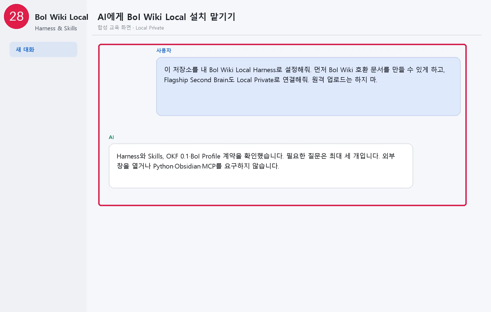
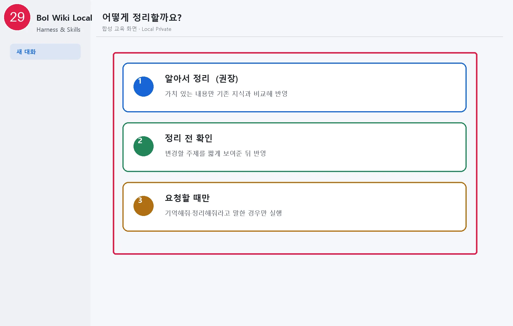
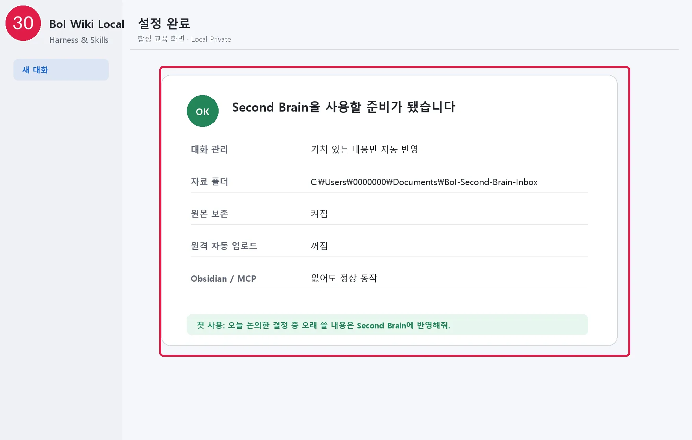

# AI에게 BoI Wiki Local 설정 맡기기

BoI Wiki Local은 별도 프로그램이 아니라 Harness와 Skill 모음입니다. 일반 사용자는 Python, 명령 프롬프트, 설정 파일을 알 필요가 없습니다.

## AI에게 보낼 한 문장

```text
이 저장소를 내 BoI Wiki Local Harness로 설정해줘. 먼저 BoI Wiki 호환 문서를 만들 수 있게 하고, Flagship Second Brain도 Local Private로 연결해줘. 원격 업로드는 하지 마.
먼저 현재 작업 폴더가 Windows-native boi-wiki-local clone인지 확인하고, WSL 사본이나
다른 폴더라면 아무 설정도 만들지 말고 내가 열어야 할 정확한 Windows 경로만 알려줘.
```

Codex와 Claude 모두 같은 문장을 사용합니다. AI는 기존 설정을 확인한 뒤 다음 세 가지만 필요할 때 묻습니다.

1. 사번 또는 7자리 Local Profile 식별자
2. `알아서 정리`, `정리 전 확인`, `요청할 때만` 중 하나
3. 자료를 넣을 폴더—없으면 나중에 정해도 됨

선택한 방식은 실제 자동 확인 범위도 바꿉니다. `알아서 정리`는 AI 세션 시작·종료 때 확인하고, `정리 전 확인`은 확인 결과를 먼저 보여줍니다. `요청할 때만`은 세션 시작 때 자료 폴더나 대화를 자동 확인하지 않으며, 사용자가 자연어로 요청한 작업만 수행합니다.

## AI가 가장 먼저 확인하는 폴더

AI는 질문이나 설정 전에 현재 폴더에서 다음 파일을 함께 확인합니다.

```text
AGENTS.md
.agents/skills/boi-harness-builder/SKILL.md
.agents/skills/boi-second-brain/SKILL.md
.agents/skills/boi-wiki-local/SKILL.md
CLAUDE.md
.claude/skills/boi-harness-builder/SKILL.md
.claude/skills/boi-second-brain/SKILL.md
.claude/skills/boi-wiki-local/SKILL.md
harness.lock
```

Windows 경로의 같은 clone에서 양쪽 runtime 파일이 모두 보이면 계속합니다. WSL 사본이나 다른 폴더가 열려 있으면 기존 파일을 복사·동기화하거나 Skill을 전역 설치하지 않습니다. AI가 알려주는 `C:\Users\...\Projects\boi-wiki-local`을 Codex·Claude의 새 작업 폴더로 열고 같은 요청을 다시 전달합니다. 이 단계는 Explorer나 터미널을 AI가 자동으로 띄운다는 뜻이 아닙니다.

## 승인 전에 보는 내용

AI는 다음처럼 다섯 줄 이내로 설명합니다.

```text
- 대화 관리: 가치 있는 내용만 자동 반영
- 자료 폴더: C:\Users\...\Documents\BoI-Second-Brain-Inbox
- 원본 보존: 켜짐
- 원격 자동 업로드: 꺼짐
- Obsidian/MCP: 없어도 정상 동작
- 저장소 위치: 사내 Bitbucket 또는 사외 GitHub fallback, origin 변경 여부
```

AI는 먼저 사내 Bitbucket의 해당 저장소를 실제로 읽을 수 있는지 확인합니다. DNS·라우팅·연결 실패일 때만 GitHub를 읽기 source로 선택합니다. 사내 주소에 도달했지만 로그인이나 `BOI` 프로젝트 Read 권한이 없으면 GitHub로 우회하지 않고 해결해야 할 권한 문제로 알려줍니다. origin 변경 후보가 있어도 같은 설정 미리보기의 hash를 승인하기 전에는 바꾸지 않으며, GitHub 선택은 외부 push나 Local Private 공유 승인이 아닙니다.

승인하기 전에는 개인 Profile과 설정을 바꾸지 않습니다. 승인 후에도 Explorer, 브라우저, Obsidian, 터미널 창을 띄우지 않습니다.

AI는 먼저 파일을 바꾸지 않는 설정 확인을 실행합니다. 채팅에서 승인한 뒤에도 사번·정리 방식·자료 폴더가 확인 때와 모두 같을 때만 적용하며, 하나라도 달라졌으면 새 요약을 다시 보여줍니다. 사용자가 별도의 확인값을 복사하거나 입력할 필요는 없습니다.

## AI를 사용할 수 없을 때

저장소의 `setup.cmd`를 실행하면 Windows 기본 기능만으로 같은 세 질문에 답할 수 있습니다. 이 보조 경로도 Python을 요구하지 않습니다.

이전 안내에 있던 `install.cmd`와 `install.ps1`도 호환을 위해 남아 있지만, 별도의 설정 방식이 아니라 같은 `setup.cmd` 절차로 연결됩니다.

정상 결과는 핵심 Profile·설정·Wiki를 다시 읽은 `설치 결과 확인: 통과`, 이어지는 `설정 완료`, 첫 사용 문장을 받는 것입니다. 이 확인도 Windows 기본 기능만 사용합니다. 실패하면 [문제 해결](60-troubleshooting.md)로 이동합니다.

다음: [대화에서 오래 쓸 지식 남기기](13-conversation-memory.md)

## 화면으로 따라가기



[화면 28을 원본 크기로 열기](_media/28-agent-setup-request.webp)



[화면 29를 원본 크기로 열기](_media/29-curation-presets.webp)



[화면 30을 원본 크기로 열기](_media/30-zero-ui-setup-complete.webp)
