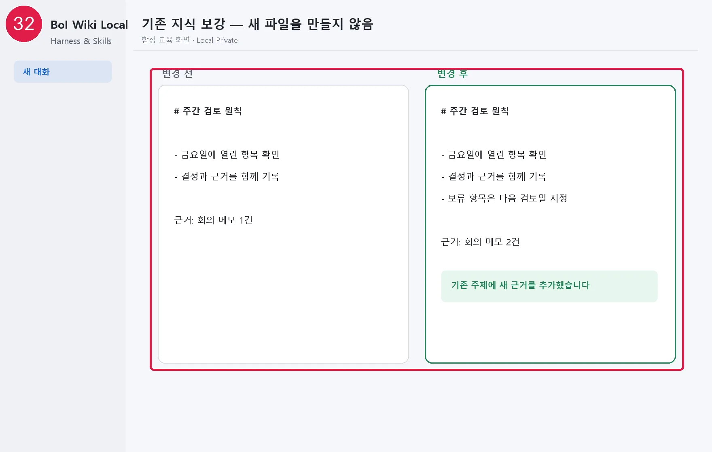

# 대화에서 오래 쓸 지식 남기기

Second Brain은 채팅 보관함이 아닙니다. AI는 대화가 끝나기 전에 장기적으로 다시 쓸 가치가 있는지 판단하고, 먼저 기존 문서를 찾습니다.

## 남기는 내용

- 반복해서 사용할 의사결정과 근거
- 직접 확인한 업무 선호와 협업 방식
- 재사용 가능한 절차와 해결 방법
- 나중에 이어서 확인해야 할 중요한 열린 항목

인사, 일회성 상태, 이미 반영된 내용, 비밀번호와 인증정보, 원시 대화 전문은 남기지 않습니다.

## 세 가지 방식

| 선택 | 실제 동작 |
|---|---|
| 알아서 정리 | AI 세션 시작·종료 때 기존 지식을 찾아 보강하거나 필요한 경우에만 새 주제를 만듦 |
| 정리 전 확인 | AI 세션 시작·종료 때 확인하되 어떤 주제를 어떻게 바꿀지 짧게 보여준 뒤 반영 |
| 요청할 때만 | 세션 시작 자동 확인 없이 `기억해줘`, `정리해줘`라고 말한 경우에만 수행 |

## 자연어 예시

```text
오늘 합의한 검토 원칙은 다음에도 쓸 수 있게 반영해줘.
이 기억은 틀렸어. 최신 결정은 A가 아니라 B야.
이 내용은 이번 주만 유효하니 Second Brain에는 남기지 마.
앞으로는 정리 전 확인 방식으로 바꿔줘.
```

틀린 기억을 교정하면 예전 내용을 지우지 않고 변경 이력을 보존한 채 최신 내용을 검색 우선순위로 올립니다. AI의 추론은 직접 확인된 사실과 구분하고, 충돌하거나 민감한 내용은 `확인 필요`로 둡니다.

대화에서 만든 기억은 Local Private이며 조직 Wiki에 바로 올릴 수 없습니다. 공유하려면 일반 knowledge·context pack·SOP로 정제한 뒤 promotion 미리보기와 승인을 거칩니다.

다음: [자료 폴더에 파일 넣고 정리하기](14-folder-auto-curation.md)

## 화면 32 — 같은 주제의 기존 지식 보강



[화면 32를 원본 크기로 열기](_media/32-memory-before-after.webp)
