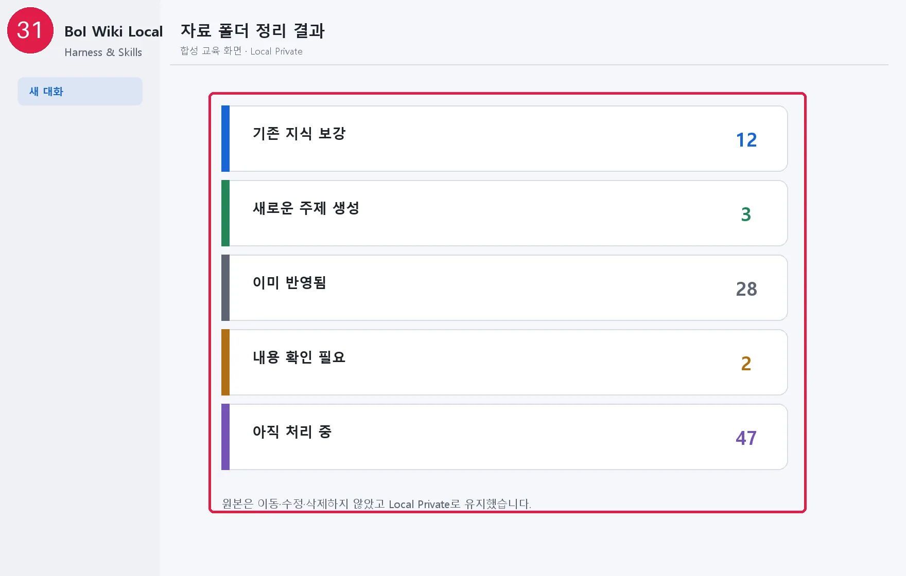
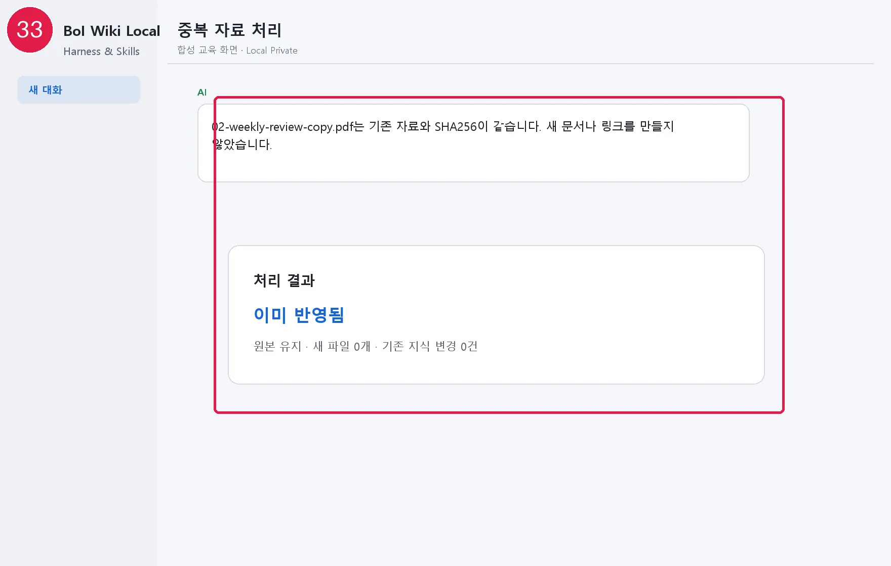

# 자료 폴더에 파일 넣고 정리하기

기본 폴더는 `%USERPROFILE%\Documents\BoI-Second-Brain-Inbox`입니다. Outlook에서 저장한 `.eml`, 웹 문서, Markdown·텍스트, CSV, PDF, 이미지, 회의 메모를 넣을 수 있습니다.

## 동작 시점

상주 프로그램은 없습니다. AI를 실행하지 않은 동안에는 아무 작업도 하지 않습니다. `알아서 정리`와 `정리 전 확인`에서는 다음 Codex 또는 Claude 세션이 시작될 때 새 파일과 바뀐 파일을 확인합니다. `요청할 때만`에서는 세션 시작 때 폴더를 자동으로 읽지 않으며, 사용자가 `자료 폴더를 정리해줘`라고 요청한 뒤에만 확인합니다.

## AI가 하는 일

1. 파일 내용과 SHA256을 확인해 같은 원본을 중복 처리하지 않습니다.
2. 임시 파일, 저장 중인 파일, 지원하지 않는 형식은 건너뜁니다.
3. 원본은 이동·수정·삭제하지 않고 Local Private 사본과 정확한 출처·SHA256을 보존합니다.
4. 읽을 수 있는 이메일·웹·Markdown·텍스트·표 자료는 출처 등록 문서와 파생 문서를 따로 늘리지 않고, 같은 작업에서 주장·결정·제약·반증·미확인·검토 상태가 있는 재사용 지식 하나로 정리합니다.
5. PDF·이미지도 승인 후 AI가 실제 페이지나 화면 영역을 열어 확인할 수 있으면 같은 방식으로 정리합니다. 확인한 페이지·영역과 읽기 어려운 부분을 함께 남기며, 보이지 않은 내용을 추측하거나 OCR을 몰래 사용하지 않습니다.
6. 현재 AI가 신뢰성 있게 읽을 수 없는 파일, 지원하지 않는 형식, 불완전하게 보이는 자료, 격리가 필요한 자료만 출처 정보 문서로 보류합니다. 기존 지식과 비교한 결과는 보강·수정·새 주제·확인 필요로 나눕니다.
7. 자료가 많으면 주제별 묶음으로 처리하고 다음 세션에 이어갑니다.

파일 개수는 고정 처리 한도가 아닙니다. 자료 수, 형식, 중복, 연결 정도에 따라 AI가 안전한 묶음 크기를 정합니다.

## 처음 정리할 때 한 번 확인

처음에는 파일을 만들지 않고 대상 파일 수, 중복, 정리 묶음, 기존 지식과의 관계, 원본 보존과 원격 업로드 꺼짐을 미리 보여줍니다. 범위가 맞으면 “이 미리보기의 자료와 범위대로 정리해줘”라고 한 번 승인합니다. 이후에는 파일마다 승인을 반복하지 않습니다.

세션이 끝나 일부만 처리됐으면 “승인했던 자료 폴더 정리를 중단된 지점부터 이어서 해줘”라고 말합니다. AI는 승인한 계획과 현재 파일을 다시 대조합니다. 그대로면 다음 묶음부터 이어가고, 파일이나 범위가 달라졌으면 쓰기 전에 새 미리보기를 보여줍니다. 이미 반영한 파일은 다시 만들지 않습니다.

## 결과 예시

```text
자료 폴더 정리 결과

- 기존 지식 보강: 12개
- 새로운 주제 생성: 3개
- 이미 반영됨: 28개
- 내용 확인 필요: 2개
- 아직 처리 중: 47개
```

`알아서 정리`에서는 파일마다 승인을 묻지 않습니다. 단, 보안상 민감하거나 기존 지식과 충돌하는 자료는 자동으로 덮어쓰지 않고 확인 대상으로 남깁니다.

웹 주소를 직접 크롤링하거나 Outlook 서버에 자동 접속하지 않습니다. 사용자가 저장한 로컬 자료만 다룹니다. 자세한 형식별 주의점은 [안전한 evidence 수집](28-safe-evidence-intake.md)을 참고합니다.

다음: [생성·갱신·보류 결과 검토하기](15-memory-review-and-correction.md)

## 화면으로 결과 확인하기



[화면 31을 원본 크기로 열기](_media/31-inbox-curation-summary.webp)



[화면 33을 원본 크기로 열기](_media/33-duplicate-already-reflected.webp)
