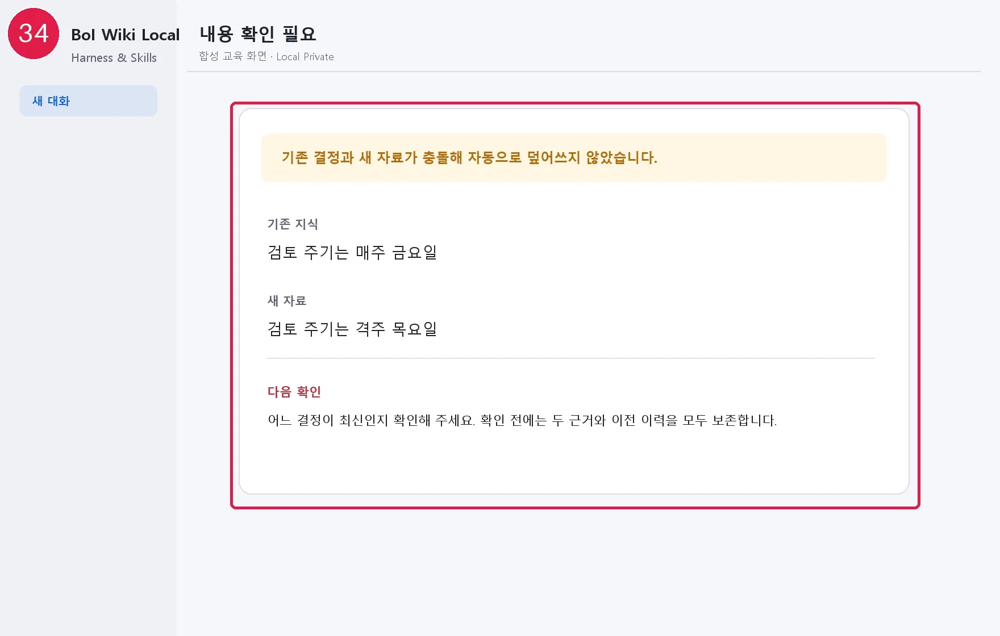

# 생성·갱신·보류 결과 검토하기

자동 정리가 끝나면 AI는 파일 목록보다 결과의 의미를 먼저 설명합니다.

- `새로 생성`: 기존 주제에 들어갈 수 없어 새 지식이 생김
- `기존 지식 보강`: 같은 주제에 근거나 최신 상태가 추가됨
- `이미 반영됨`: 중복이라 새 파일을 만들지 않음
- `확인 필요`: 충돌, 민감정보, 낮은 확신 때문에 자동 반영하지 않음
- `아직 처리 중`: 다음 AI 세션에서 이어갈 자료

## 교정하기

```text
이 기억은 틀렸어. 결정일은 7월 3일이 아니라 7월 5일이야.
이 항목은 개인 메모라서 조직지식 후보에서 제외해줘.
확인 필요 2건의 근거와 충돌 지점을 보여줘.
```

교정 전 문서는 Local archive에 남겨 이력을 추적할 수 있게 합니다. 연결된 다른 문서가 오래된 결론을 사용하는지도 함께 확인합니다.

## 자동 기능 바꾸거나 끄기

```text
앞으로 대화 정리는 적용 전에 확인받아줘.
자료 폴더 자동 정리는 끄고, 내가 요청할 때만 실행해줘.
Second Brain 자동 관리를 다시 켜줘.
```

범위가 달라지는 변경은 AI가 쉬운 요약을 다시 보여주고 승인받습니다. 원격 자동 업로드는 어떤 모드에서도 켜지지 않습니다.

`요청할 때만`으로 바꾸면 AI 시작·종료 시 자동 확인도 함께 꺼집니다. 다시 `알아서 정리` 또는 `정리 전 확인`으로 바꾸면 자동 확인을 다시 켜는 변경 요약을 먼저 확인합니다.

다음: [첫 10분 Capture·검색·정제](20-first-10-minutes.md)

## 화면 34 — 충돌은 자동으로 덮어쓰지 않음



[화면 34를 원본 크기로 열기](_media/34-conflict-needs-review.webp)
