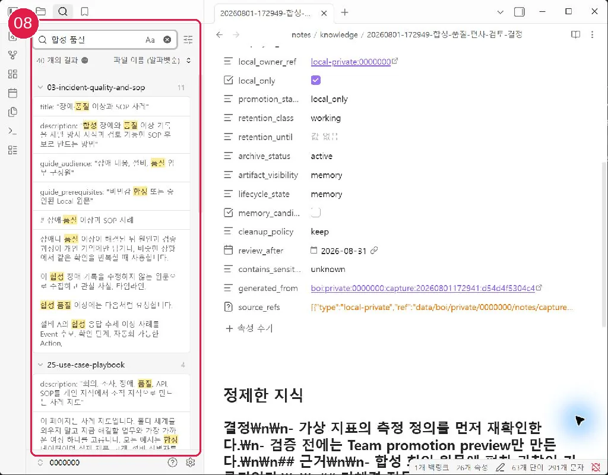

# 10분 Second Brain 튜토리얼

## 1. 원문 수집

에이전트에게 다음과 같이 요청합니다.

```text
오늘 회의 메모를 수정하지 않는 원문으로 수집해줘.
```

생성된 원문에는 SHA256과 `source_immutability: locked`가 기록됩니다.

## 2. 지식으로 정제

```text
방금 수집한 원문을 핵심 결정, 근거, 후속 작업으로 정제해줘. 원문은 고치지 마.
```

정제 문서는 `notes/knowledge/`에 생성되고 원문을 `source_refs`로 가리킵니다.

## 3. 다시 찾기

```text
첫 회의 메모와 관련된 로컬 문서를 근거 경로와 함께 찾아줘.
```

AI는 정제 문서를 먼저 찾고, 답변에 실제 Local 문서 경로와 근거를 붙입니다. Obsidian을 사용한다면 Core Search에서도 같은 키워드로 확인할 수 있습니다.

## 4. 검토

```text
방금 만든 원문과 정제 문서의 출처, 링크, 검토 기한과 Local Private 경계를
확인해줘. 오래됐거나 근거가 부족한 내용은 고치지 말고 확인 필요로 보여줘.
```

오래된 초안, 기억 후보, promotion 후보를 보여줄 뿐 자동 삭제하거나 공유하지 않습니다.

이전: [첫 설정과 확인](11-first-setup.md) · 다음 선택: [Obsidian 설치](30-obsidian-install-and-vault.md) 또는 [MCP와 공유](50-mcp-and-promotion.md)
## 화면 08 — Core Search로 다시 찾기



[화면 08을 원본 크기로 열기](_media/08-core-search.webp)

검색어를 입력하면 capture, 정제 지식, 사례 Wiki가 함께 나타납니다. 검색 결과가 너무 많으면 `path:notes/knowledge`를 더합니다.

다음: [Capture에서 정제·검토까지](23-capture-distill-review.md)
