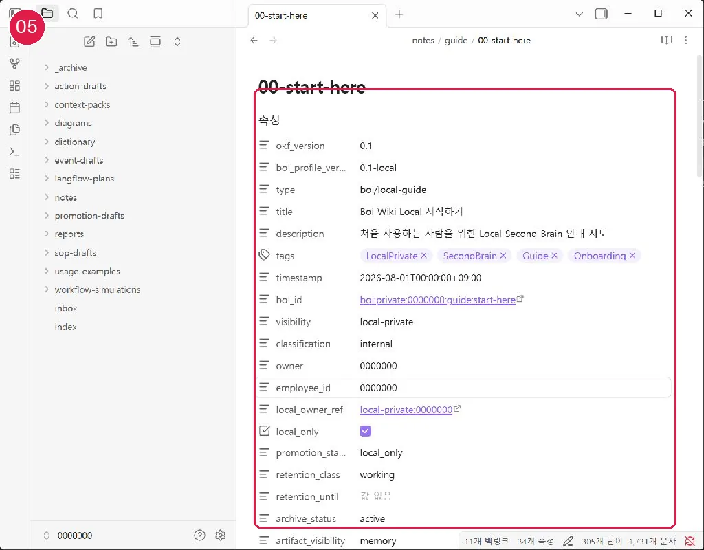

# OKF와 BoI Profile 이해하기

대상은 모든 사용자이며 약 5분이 걸립니다. 먼저 [10분 튜토리얼](20-first-10-minutes.md)을 읽으면 이해가 쉽습니다.

## 핵심 개념

- OKF 0.1은 문서의 공통 뼈대입니다. 제목, 유형, 시각, 식별자 같은 기본 구조를 맞춥니다.
- BoI Profile은 소유자, 공개 범위, 분류, 검토, 출처, 상태처럼 문서가 어떤 규칙으로 다뤄져야 하는지를 나타냅니다.
- `0.1-local`은 개인 PC 안의 수집·정제·보존 상태를 추가로 표현하는 Local 전용 Profile입니다.
- Team/Public 후보는 compiler를 거쳐 canonical OKF 0.1 + BoI Profile 0.1 후보가 됩니다.

## 최신 LLM Wiki 사례보다 먼저 지키는 계약

운영 원칙의 우선순위는 **기존 BoI Wiki 계약 → OKF 0.1 → Local/Canonical BoI Profile → Local Private 경계 → 자료 정리·질문·품질 검사 → Obsidian**입니다. LLM이나 플러그인이 편의를 위해 임의의 page type, 관계 필드, 공개 범위를 만들 수 없습니다. 원본 EML·CSV·PDF·이미지는 불변 파일이고, 그 원본 정보 문서와 모든 파생 Markdown이 OKF·BoI Profile을 가집니다.

## 정상 결과와 실패 시 이동

문서의 frontmatter에서 두 버전을 찾고, `local-private`가 웹의 `private`와 다른 값임을 설명할 수 있으면 정상입니다. 필드 검사 오류는 [문제 해결](60-troubleshooting.md)을 봅니다.

## Local/Remote 경계와 다음 여정

Local Profile은 기존 BoI Wiki가 직접 읽는 제출 형식이 아닙니다. 파일 확장자를 바꾸거나 복사해도 원격 문서가 되지 않습니다. 다음: [Local과 canonical Profile](22-local-vs-canonical-profile.md)
## 화면 05 — Properties에서 경계 확인

[화면 05를 원본 크기로 열기](_media/05-obsidian-properties.webp)

`okf_version: 0.1`, `boi_profile_version: 0.1-local`, `visibility: local-private`, `local_only: true`가 Local Second Brain의 경계입니다.
