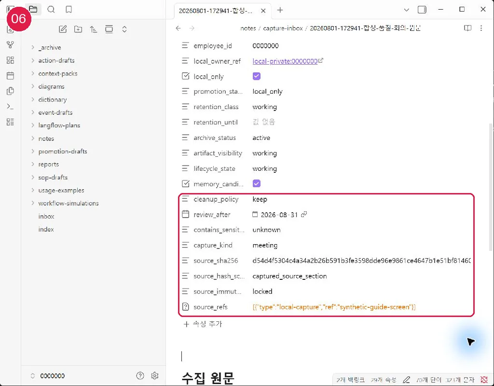
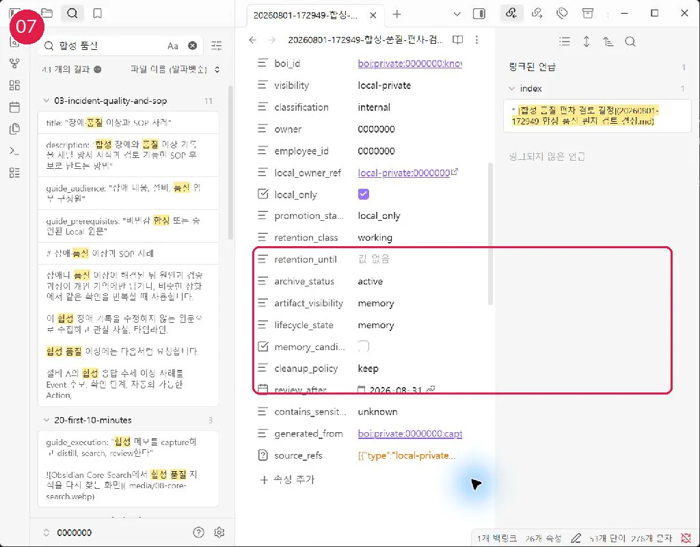

# Capture에서 지식까지

대상은 일상 사용자이며 첫 실행은 약 10분입니다. 설치와 사번 Profile 설정이 선행 조건입니다.

## 실행 단계

1. AI에게 회의 메모, 질문, 조사 단서를 수정하지 않는 원문으로 수집해 달라고 요청합니다.
2. capture 파일은 수정하지 않습니다. SHA256이 원문 불변성을 증명합니다.
3. AI에게 결정, 근거, 미해결 질문, 후속 작업을 별도 knowledge 문서로 정제해 달라고 요청합니다.
4. `source_refs`와 `generated_from`으로 정제 문서를 원문에 연결합니다.
5. 검색 후 관련 문서 링크를 추가하고, 일간·주간 review에서 보존·정제·archive 후보를 결정합니다.

## 정상 결과와 실패 시 이동

원문과 정제 문서가 서로 다른 파일이고 hash 검사가 통과하면 정상입니다. 원문 hash가 달라졌다면 즉시 편집을 멈추고 [문제 해결](60-troubleshooting.md)을 봅니다.

## Local/Remote 경계와 다음 여정

capture 원문은 promotion 대상이 아닙니다. 조직 공유는 정제 문서에서 별도 후보를 만듭니다. 다음: [일간·주간 Review](24-daily-weekly-review.md)
## 화면 06 — 불변 Capture

[화면 06을 원본 크기로 열기](_media/06-immutable-capture.webp)

원문의 `source_sha256`과 `source_immutability: locked`를 확인합니다. 원문을 고쳐 쓰지 말고 새 정제 문서를 만듭니다.

## 화면 07 — 정제본의 provenance

[화면 07을 원본 크기로 열기](_media/07-distilled-provenance.webp)

정제본은 `generated_from`과 `source_refs`로 원문을 가리킵니다. 이 연결이 있어야 근거를 다시 확인하고 promotion에서 Local 경로를 제거할 수 있습니다.
