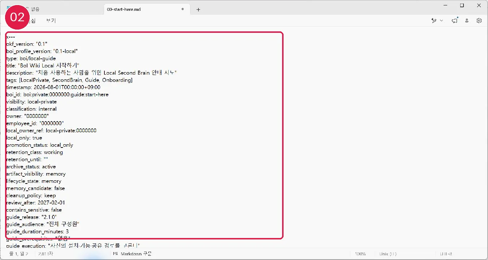

# Obsidian 없이 사용하기

대상은 최소 설치 사용자이며 첫 사용은 약 10분입니다. Windows 설치와 Profile 설정만 필요합니다.

## 실행 단계

1. Markdown은 메모장, VS Code 또는 허용된 편집기로 엽니다.
2. AI에게 자연어로 수집·정제·검색·검토를 요청합니다.
3. Wiki 링크는 Git 뷰어나 편집기의 Markdown 미리보기로 이동합니다.
4. AI에게 `내 Local 문서의 OKF·BoI 규칙, 출처, 링크와 검토 기한을 확인해줘`라고 요청합니다.

## 정상 결과와 실패 시 이동

Obsidian 관련 파일이 없어도 capture·distill·search·review·promotion preview가 동작하면 정상입니다. 일반 사용자 경로는 Python을 요구하지 않습니다. Git 또는 Windows 권한 오류는 [문제 해결](60-troubleshooting.md)을 봅니다.

## Local/Remote 경계와 다음 여정

Obsidian은 시각화·backlink·Properties를 확장할 뿐 저장 형식이나 promotion 권한을 바꾸지 않습니다. 다음: 필요할 때만 [Obsidian 설치](30-obsidian-install-and-vault.md)
## 화면 02 — 일반 Markdown으로 열기

[화면 02를 원본 크기로 열기](_media/02-notepad-markdown.webp)

메모장에서도 `okf_version`, `boi_profile_version`, `visibility`를 읽을 수 있습니다. Obsidian은 이 Markdown을 더 편하게 탐색하는 선택 기능일 뿐입니다.

다음: [10분 Second Brain 튜토리얼](20-first-10-minutes.md)
