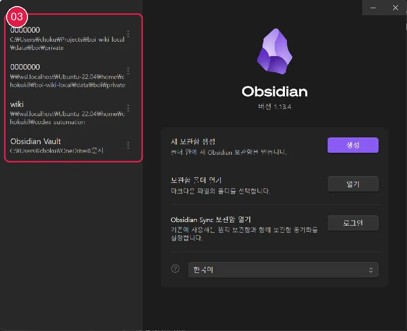

# Obsidian 설치와 Vault 연결

Obsidian은 선택 사항입니다. 앱을 지워도 Markdown 파일과 로컬 명령은 그대로 동작합니다.

## Windows 설치

1. [Obsidian 공식 다운로드](https://obsidian.md/download)에서 Windows 설치 파일을 받습니다.
2. 파일 출처와 게시자가 Obsidian인지 확인합니다.
3. 설치 프로그램 실행 전 사용자 확인을 거칩니다.
4. 설치 후 Obsidian을 실행합니다.

회사 소프트웨어 정책이 있으면 그 정책을 우선합니다. 비공식 배포처의 설치 파일은 사용하지 않습니다.

## 연결 전 진단

Windows Obsidian으로 열기 전에 AI에게 다음처럼 요청합니다.

```text
Windows Obsidian으로 내 Local Private 폴더를 열어도 안전한지 확인해줘.
기존 설정은 보존하고, 바뀔 Core 설정이 있으면 적용 전에 보여줘.
```

AI가 연결을 중단하라고 안내하면 Obsidian 설정을 적용하지 않습니다. Obsidian 없이 [10분 튜토리얼](20-first-10-minutes.md)을 계속할 수 있습니다.

## Local Private 폴더를 Vault로 열기

1. Obsidian에서 **Open folder as vault**를 선택합니다.
2. 이 저장소의 `data/boi/private/{{employee_id}}` 폴더를 선택합니다.
3. 새 문서를 하나 만들었다가 삭제해 파일 변경이 즉시 반영되는지 확인합니다.
4. [가이드 홈](00-start-here.md)이 열리는지 확인합니다.

별도 복제 Vault를 만들거나 Local Private 원문을 다른 동기화 폴더로 복사하지 않습니다.

파일 감시가 정상임을 확인한 뒤에만 채팅에서 Core 설정 변경안을 승인합니다. AI는 기존 설정을 덮어쓰지 않고 자신이 새로 만든 설정만 추적합니다.

## WSL 경로 주의

Windows Obsidian에서 `\\wsl$\...` 또는 `\\wsl.localhost\...` 경로를 열면 파일 변경 감시가 늦거나 실패할 수 있습니다. 실제 Windows Obsidian 1.12.7 검증에서는 Vault를 여는 즉시 `EISDIR: illegal operation on a directory, watch` 오류가 발생했습니다.

같은 오류가 보이면 다음과 같이 처리합니다.

1. 오류가 난 Vault 창만 닫습니다.
2. Obsidian 연동을 비활성 상태로 두고 로컬 명령과 에이전트를 계속 사용합니다.
3. 같은 파일을 Windows 폴더나 동기화 폴더로 자동 복제하지 않습니다.
4. 저장 위치나 실행 환경을 바꾸려면 별도의 사용자 결정과 이전 계획을 먼저 만듭니다.

이 오류는 선택형 뷰어 연동 실패이며 Local Second Brain 데이터나 검색·정제 기능의 실패가 아닙니다.

## 설정 복구

에이전트가 만든 Core 설정만 되돌리려면 `내가 수정한 설정과 Markdown은 보존하고, AI가 만든 Obsidian 설정만 되돌릴 대상을 먼저 보여줘`라고 요청합니다.

해시가 그대로인 managed 파일만 제거됩니다. 사용자가 수정한 파일, Obsidian이 자체 생성한 파일, Vault 폴더와 Markdown 문서는 보존됩니다.

## 기본 보안값

- Obsidian Sync와 Publish는 자동으로 활성화하지 않습니다.
- `.obsidian` 설정에는 PAT, API 키, 사내 비밀번호를 저장하지 않습니다.
- 커뮤니티 플러그인은 아직 활성화하지 않습니다.

이전: [10분 튜토리얼](20-first-10-minutes.md) · 다음: [Core 기능 설정](31-obsidian-core-settings.md)
## 화면 03 — Local Private Vault 선택



[화면 03을 원본 크기로 열기](_media/03-vault-manager.webp)

`보관함 폴더 열기`에서 `data\boi\private\<사번>`을 선택합니다. 저장소 루트 전체나 `templates` 폴더를 Vault로 열지 않습니다.
