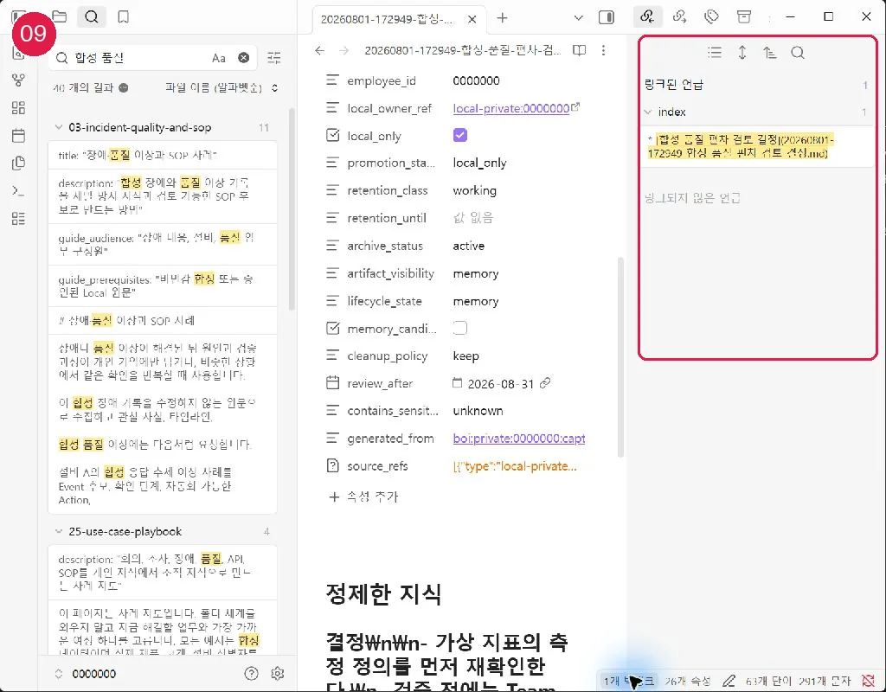
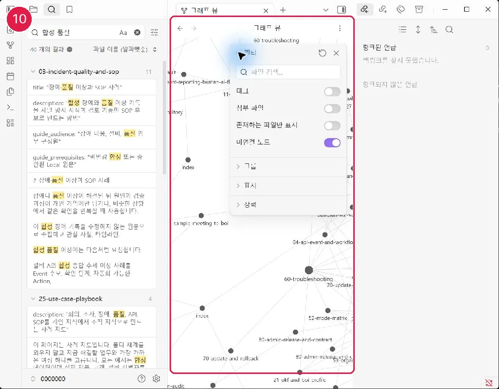
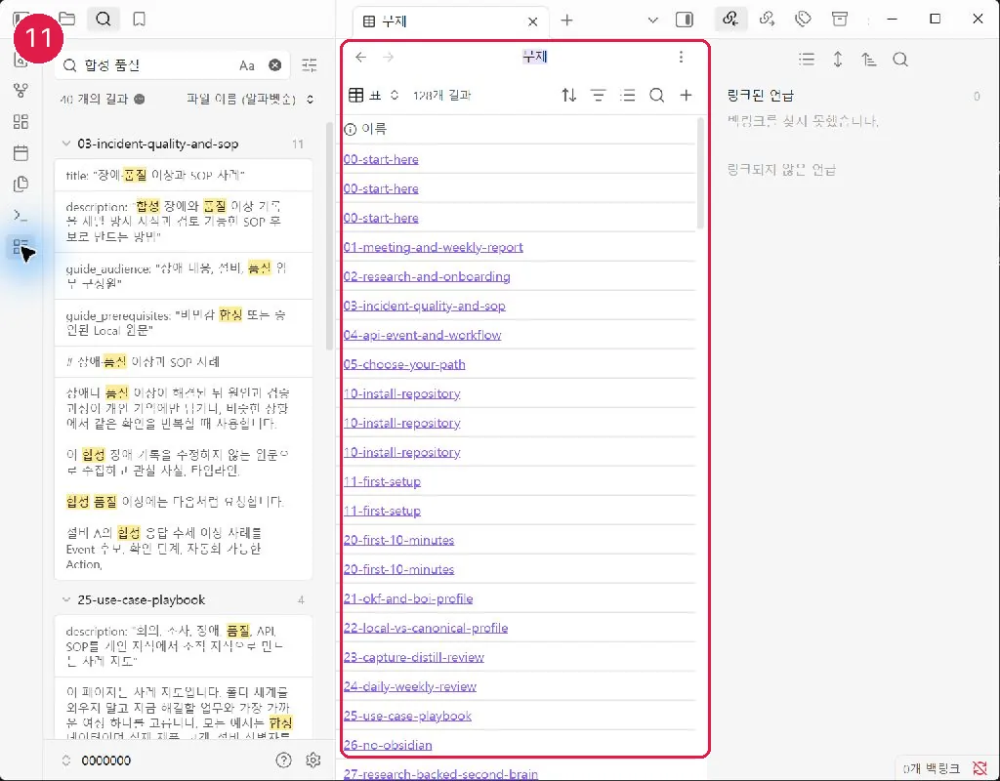
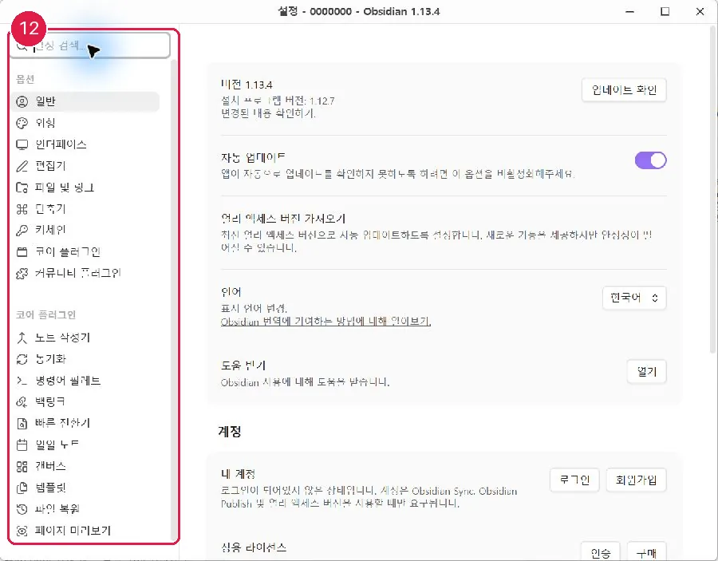

# Obsidian Core 기능 설정

Vault 열기와 파일 감시 검증을 통과한 뒤에만 이 설정을 적용합니다. WSL Vault가 `blocked-verified`라면 이 페이지의 설정을 건너뜁니다.

Settings의 Core plugins에서 다음 기능만 우선 활성화합니다.

- Search와 Quick Switcher: 제목과 본문을 빠르게 찾습니다.
- Backlinks와 Outgoing Links: 현재 문서의 앞뒤 연결을 확인합니다.
- Properties: OKF·BoI frontmatter를 읽고 편집합니다.
- Bases: 메타데이터 기준으로 문서 목록을 만듭니다.
- Canvas: 여러 문서를 임시로 배치해 비교하거나 생각을 정리합니다.
- Templates, Bookmarks, Page Preview: 반복 입력과 탐색을 돕습니다.
- Graph: 관계를 살펴보는 보조 화면으로만 사용합니다.

Properties는 기본적으로 **Source** 또는 YAML을 정확히 보존하는 방식으로 편집합니다. 필드 이름을 번역하거나 임의로 중첩하지 않습니다.

Graph에서는 다음 경로를 제외하면 개인 지식 연결을 보기 쉽습니다.

```text
-path:notes/capture-inbox -path:notes/guide -path:promotion-drafts -path:usage-examples -path:_archive
```

기존 Vault에 `.obsidian` 설정 파일이 있으면 자동 설정은 그 파일을 덮어쓰지 않습니다. `obsidian-preview` 결과가 `preserve`라면 위 필터를 Obsidian의 **Graph → Filters → Search files**에 직접 붙여 넣습니다. 새 Vault에서 설정 파일이 없을 때만 승인 후 기본 Core 설정과 이 필터를 생성합니다.

앞의 `-`는 해당 경로를 Graph에서 제외한다는 뜻입니다. 가이드·원문 inbox·promotion 초안·archive를 숨기면 실제 지식 문서의 연결과 고립 문서를 보기 쉽습니다. Graph는 플랫폼의 canonical 관계 데이터가 아니라 로컬 Markdown 링크 탐색 도구입니다. 문서 관계의 근거는 `source_refs`, `generated_from`, 실제 Markdown 링크에 남깁니다.

자동 설정을 사용했다면 변경 전 `obsidian-preview`, 변경 후 `obsidian-recover-preview`를 실행할 수 있습니다. 복구는 managed manifest에 기록된 파일 중 사용자가 수정하지 않은 파일만 대상으로 합니다.

이전: [Obsidian 설치와 Vault](30-obsidian-install-and-vault.md) · 다음: [커뮤니티 플러그인 보안](40-community-plugin-safety.md)
## 화면 09 — Backlinks와 원문 연결



[화면 09를 원본 크기로 열기](_media/09-backlinks-outgoing.webp)

Backlinks는 현재 지식을 참조하는 문서를 보여줍니다. 링크가 있다는 이유만으로 내용이 정확하다고 판단하지 말고 원문과 출처를 확인합니다.

## 화면 10 — 필터 Graph



[화면 10을 원본 크기로 열기](_media/10-filtered-graph.webp)

Graph는 탐색 보조 수단입니다. capture·promotion draft·archive를 필터링하면 정제 지식의 연결을 보기 쉽지만, 노드 수를 지식 품질로 사용하지 않습니다.

## 화면 11 — Properties 기반 Bases



[화면 11을 원본 크기로 열기](_media/11-properties-bases.webp)

Bases는 파일을 별도 데이터베이스로 옮기지 않고 기존 Markdown Properties를 목록으로 보여줍니다. `lifecycle_state`, `review_after`, `promotion_status`로 검토 대상을 좁힙니다.

## 화면 12 — Core plugins 기본 경로



[화면 12를 원본 크기로 열기](_media/12-core-plugins.webp)

Backlinks, Quick switcher, Templates, Canvas 같은 Core 기능만으로 시작합니다. Community plugin은 보안 검토와 사용자 승인 후 선택합니다.

Bases는 상태 목록, Graph는 연결·고립 탐색, Canvas는 임시 사고 공간으로만 사용합니다. 업무 도메인과 관계없이 canonical 관계는 표준 Markdown 링크와 Properties에 남깁니다.
