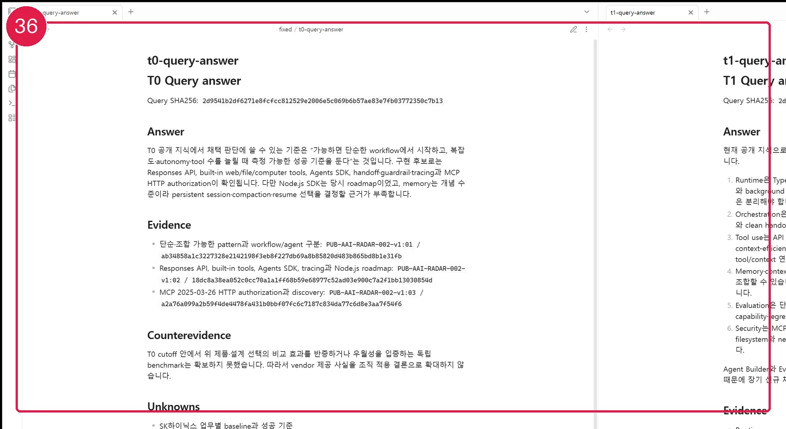
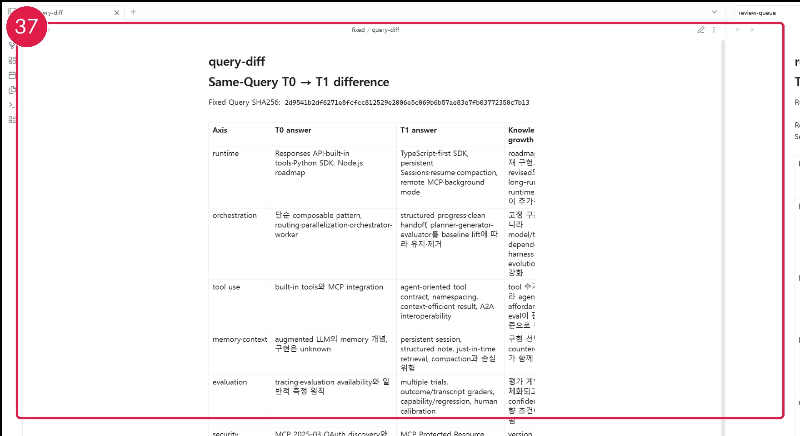
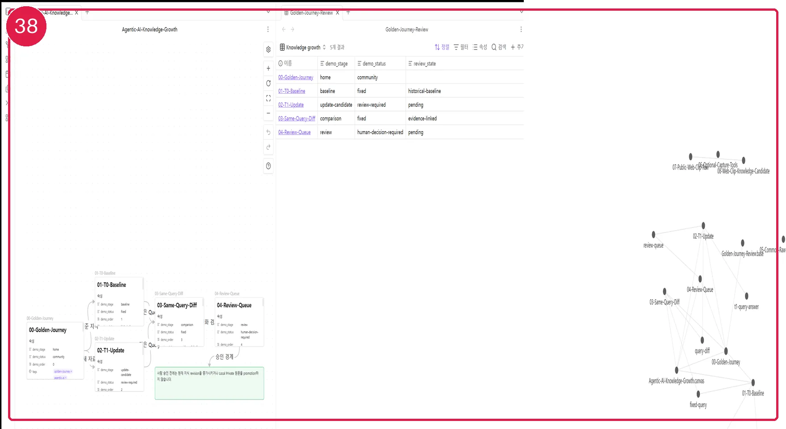
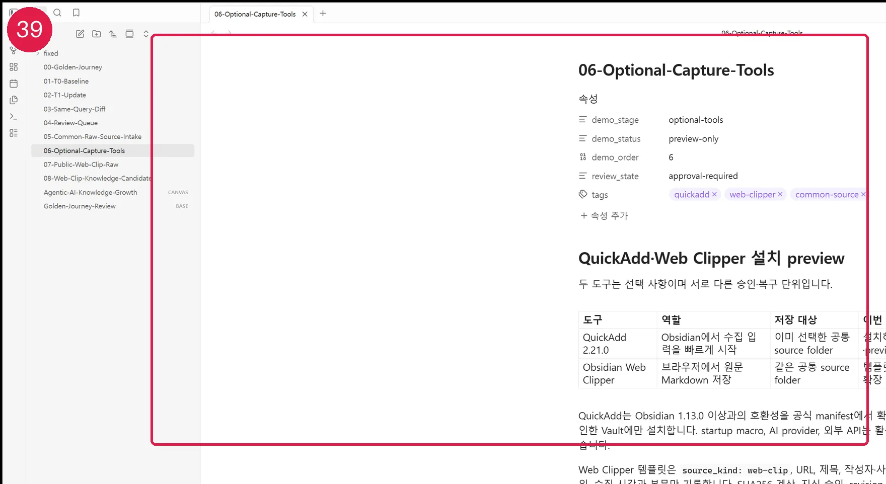
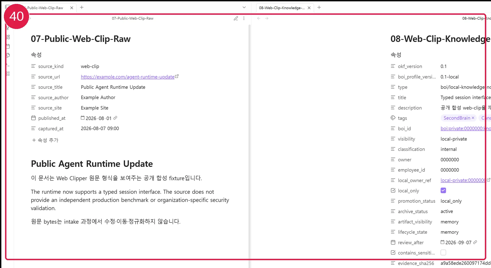

# Obsidian으로 Golden Journey 탐색하기

먼저 공개 `Agentic AI Change Radar` 사례로 지식이 자라는 모습을 확인합니다. AI에게 다음처럼 요청하면 개인 Vault 대신 공개 파일만 담은 sanitized 임시 Vault를 준비하고, 변경 내용을 보여준 뒤 열어 줍니다.

```text
Obsidian으로 Golden Journey를 안전하게 열어줘.
개인 Vault와 Local Private 자료는 건드리지 말고 공개 Community 사례만 사용해.
```

AI는 설치 상태를 확인하고, 만들 임시 Vault와 포함 파일을 미리 보여준 다음 승인된 내용만 적용합니다. 임시 Vault는 공개 walkthrough와 고정 T0·T1 파일만 포함하며 `.env`, 개인 경로, Git 정보와 Local Private 원문을 복제하지 않습니다. Obsidian이 없거나 CLI가 비활성화돼도 일반 Markdown으로 같은 흐름을 읽을 수 있습니다.


[화면 35를 원본 크기로 열기](_media/35-golden-journey-home.webp)

이 사례는 Community 재현성 데모입니다. 실제 사용자의 승인된 현재 지식, SK하이닉스 운영 검증, Verified 또는 production-ready 결과가 아닙니다.

## 1. 최초 기준과 업데이트 후보 비교

왼쪽은 최초 기준 지식의 답변, 오른쪽은 새 공개 자료를 반영한 업데이트 후보 답변입니다. 같은 Query와 같은 SHA256을 사용하므로 질문이 달라져 답변이 변한 것이 아님을 확인할 수 있습니다.



[화면 36을 원본 크기로 열기](_media/36-t0-t1-query-compare.webp)

- Node.js roadmap 판단은 현재 TypeScript 지원으로 수정됐습니다.
- MCP discovery는 후속 규격과 충돌해 구현 버전 확인이 필요합니다.
- Agent Builder의 출시 이력은 남기되 stale·폐기 검토 후보가 됐습니다.
- 공개 자료만으로 SK하이닉스 적용성을 판단할 수 없어 unknown을 유지했습니다.

## 2. 답변 차이와 사람 검토

답변 차이는 최신 답변만 남기는 요약이 아닙니다. 이전 판단, 새 근거, 반대 근거, 변경 이유와 영향을 함께 보존합니다. contradiction, unknown과 오래된 판단은 review queue에서 사람이 판단합니다.



[화면 37을 원본 크기로 열기](_media/37-query-diff-review-queue.webp)

후보가 만들어져도 현재 승인 지식은 자동으로 바뀌지 않습니다. 사람이 승인한 변경만 다음 revision이 됩니다.

## 3. Bases·Canvas·Graph로 탐색

Bases는 문서의 단계·상태·검토 여부를 표로 좁히고, Canvas는 기준 지식에서 업데이트와 검토로 이어지는 흐름을 배치합니다. Graph와 Local Graph는 링크를 찾는 보조 화면입니다. 화면의 선 자체가 근거는 아니며, 근거는 실제 Markdown 링크와 `source_refs`, `generated_from`에 남습니다.



[화면 38을 원본 크기로 열기](_media/38-bases-canvas-local-graph.webp)

## 4. QuickAdd와 Web Clipper는 선택 설치

Core Search, Properties, Backlinks, Graph, Bases와 Canvas만으로 Golden Journey를 탐색할 수 있습니다. QuickAdd는 Obsidian에서 입력을 빠르게 시작하는 선택형 플러그인이고, Web Clipper는 브라우저에서 원문 Markdown을 저장하는 공식 확장입니다. 두 도구는 서로 다른 설치·권한·복구 단위이므로 각각 미리보기와 승인을 받습니다.

```text
QuickAdd와 Web Clipper 설치 preview를 보여줘.
이미 선택한 공통 원본 자료 폴더만 사용하고, 두 도구는 따로 승인받아.
```



[화면 39를 원본 크기로 열기](_media/39-quickadd-common-source-preview.webp)

QuickAdd 2.21.0은 공식 정보상 Obsidian 1.13.0 이상을 요구합니다. 승인한 Vault에만 설치하고 startup macro, AI provider와 외부 API는 켜지 않습니다. Web Clipper 템플릿은 URL·제목·작성자·사이트·게시일·수집 시각과 본문만 저장하며 Interpreter나 LLM 요청을 실행하지 않습니다.

## 5. Web Clipper도 공통 원본 유형

Web Clipper는 전용 inbox를 만들지 않습니다. 이메일, Markdown·TXT, CSV, PDF, 이미지와 일반 문서가 함께 들어오는 기존 공통 원본 자료 폴더에 저장하고 `source_kind: web-clip`과 URL·수집 시각으로 구분합니다.



[화면 40을 원본 크기로 열기](_media/40-web-clip-raw-candidate.webp)

왼쪽 원문 bytes는 바꾸지 않고, 오른쪽 지식 후보에는 원문 SHA256, 출처, 근거, 반대 근거, unknown, 검토 상태와 Local/Remote 경계를 남깁니다. 후보는 review queue에 머물며 승인 전에는 현재 지식 revision이나 원격 Wiki에 반영하지 않습니다.

```text
방금 저장한 웹 클립만 처리해줘.
같은 SHA256으로 이미 반영된 자료는 건너뛰고 원문은 변경하지 마.
```

## 종료와 복구

AI가 제공하는 `Detect → Preview → Apply → Verify → Recover` 흐름에서 Recover는 도구가 만든 공개 임시 Vault만 제거합니다. 개인 Vault, 원본 폴더와 기존 Obsidian 설정은 삭제하지 않습니다. 이번 데모를 실제 승인 지식으로 promotion하지 않습니다.

이전: [Obsidian Core 기능 설정](31-obsidian-core-settings.md) · 다음: [Obsidian 확장 기능 보안](40-community-plugin-safety.md)
