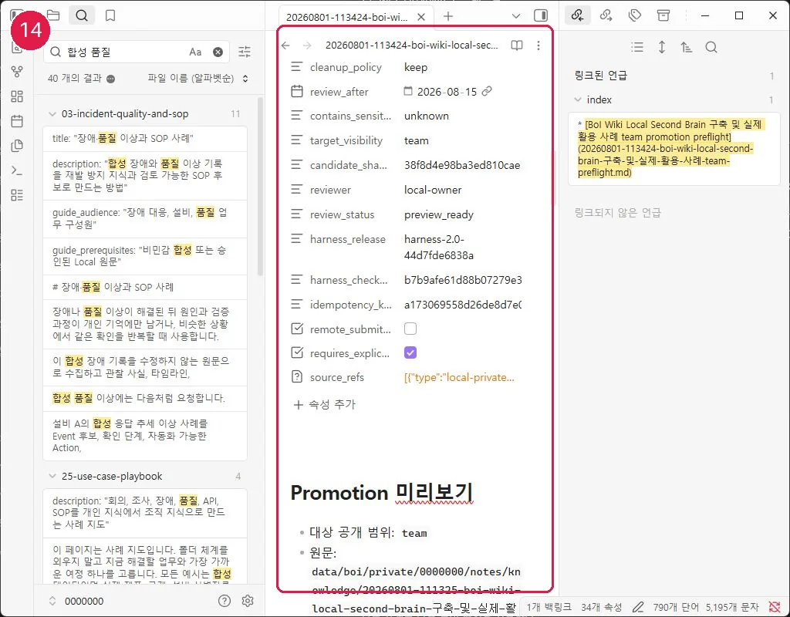

# Local Private에서 Promotion Package 만들기

대상은 Team/Public 공유 후보 작성자이며 약 10분이 걸립니다. 정제 문서, 공개 가능한 출처, reviewer가 필요하고 Team이면 team ID도 필요합니다.

## 실행 단계

```text
이 정제 지식을 Team promotion package로 준비해줘.
대상 Team, reviewer, 공개 가능한 출처가 빠졌으면 먼저 물어봐.
Local 식별자·경로·원문·민감정보를 제거한 제목과 본문을 만들고,
candidate hash와 차단 항목이 보이는 preview까지만 진행해.
```

Local case ID가 제목·설명·본문에 있다면 공유용 표현에서 제거해야 합니다. compiler는 Local case ID, 사번, 경로, `boi:private`뿐 아니라 `Local Private`, `local_only`, `local_owner_ref` 같은 Local 전용 운영 문구가 candidate에 남아 있어도 차단합니다. 원본 Local 문서를 자동으로 잘라내지 말고 공유용 제목·설명·본문을 별도로 정제해 다시 미리봅니다. 생성물은 사람이 읽는 `.md`, Local provenance가 포함된 `.package.json`, 원격 전달용 `.remote.json`입니다. 실제 대상 BoI Wiki validator 검사는 배포 관리자와 지원되는 원격 capability가 수행하며, 실행하지 못했다면 호환 완료로 표시하지 않습니다.

## 정상 결과와 실패 시 이동

candidate exact hash, Harness release/checksum, expected revision, idempotency key가 있고 `user_confirmed`와 `remote_submit_allowed`가 모두 false면 정상입니다. reviewer·source·team ID·민감정보 오류는 수정 후 package를 새로 만듭니다.

Team/Public 후보가 preview-ready가 되려면 정제 문서의 `contains_sensitive`가 검토 완료 상태인 `false`여야 합니다. `unknown` 또는 `true`이면 문자열 비밀 패턴이 보이지 않더라도 차단됩니다. 민감한 원문을 직접 바꾸지 말고, 공유 가능한 내용만 별도 정제 문서로 만든 뒤 다시 검토합니다.

Public 후보의 `source_refs`에는 공개 URL 또는 `boi:public:` 문서만 넣습니다. `boi:team:`·`boi:private:`처럼 공개 범위가 아닌 출처가 하나라도 remote projection에 남으면 미리보기 단계에서 차단하고, 공개 가능한 근거로 교체하거나 해당 내용을 후보에서 제거합니다.

## Local/Remote 경계와 다음 여정

이 명령은 원격 API를 호출하지 않습니다. 기존 BoI Wiki의 `/promote`는 이미 Web Private에 존재하는 `boi_id`의 범위를 바꾸는 API이므로 Local Private 파일 업로드에 사용하지 않습니다. 승인 이후에도 정확히 같은 candidate hash이며 Local candidate 수신을 명시적으로 지원하는 원격 등록 capability가 있을 때만 별도 submit 단계가 가능합니다. 다음: [보안·출처 검토](72-security-and-source-review.md)
## 화면 14 — Team promotion preview 확인



[화면 14를 원본 크기로 열기](_media/14-team-promotion-preview.webp)

`target_visibility`, `reviewer`, candidate hash, Harness checksum, `remote_submit_allowed: false`, 명시적 승인 필요 여부를 한 화면에서 확인합니다. 승인 뒤 hash나 scope가 바뀌면 다시 미리보기부터 시작합니다.
