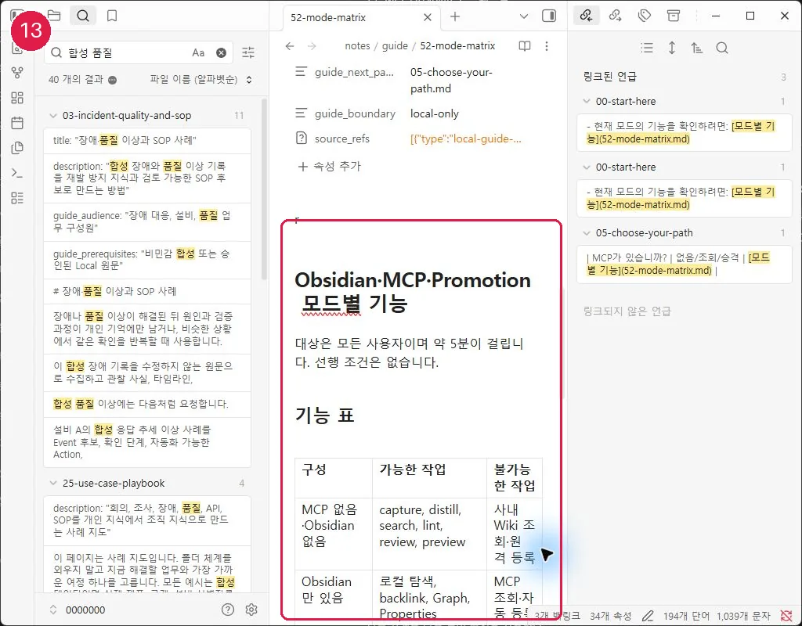

# Obsidian·MCP·Promotion 모드별 기능

대상은 모든 사용자이며 약 5분이 걸립니다. 선행 조건은 없습니다.

## 기능 표

| 구성 | 가능한 작업 | 불가능한 작업 |
|---|---|---|
| MCP 없음·Obsidian 없음 | capture, distill, search, lint, review, preview | 사내 Wiki 조회·원격 등록 |
| Obsidian만 있음 | 로컬 탐색, backlink, Graph, Properties | MCP 조회·자동 등록 |
| MCP 조회 연결 | 권한 내 BoI Wiki 검색·인용, local context 작성 | Local Private 자동 업로드 |
| MCP 인증 만료 | local-only fallback | ACL 우회·숨겨진 문서 조회 |
| promotion capability 없음 | canonical package·preview | submit |
| promotion capability 있음 | remote schema preview·validation | 승인 전 submit |
| 승인 완료 | exact hash가 같은 candidate submit | 승인 후 본문·scope 변경 |

## 반드시 기억할 경계

- MCP 없음: boi-wiki-local의 로컬 문서만 작성·검색·정리
- MCP 연결됨: 사내 boi-wiki 문서를 검색·참조하여 로컬 문서 작성 가능
- 단순 MCP 연결만으로는: Local Private 문서가 웹에 자동 적재되지 않음
- Team/Public 적재: promotion 초안 → 민감정보·출처·공개 범위 검증 → 미리보기 → 사용자 승인 → 원격 등록 기능이 지원될 때만 가능

## 정상 결과, 실패, 다음 여정

현재 모드에서 할 수 없는 작업을 도구가 명확히 거절하면 정상입니다. 연결 실패 시 local-only로 계속 사용하고 [문제 해결](60-troubleshooting.md)을 봅니다. 다음: [조직 지식 순환](53-organization-knowledge-loop.md)
## 화면 13 — 현재 모드에서 가능한 작업

[화면 13을 원본 크기로 열기](_media/13-mode-matrix.webp)

표의 핵심은 MCP 연결과 원격 등록 권한을 구분하는 것입니다. MCP 조회가 가능해도 Local Private 문서가 자동 업로드되지는 않습니다.

다음: [사용 경로 선택](05-choose-your-path.md)
