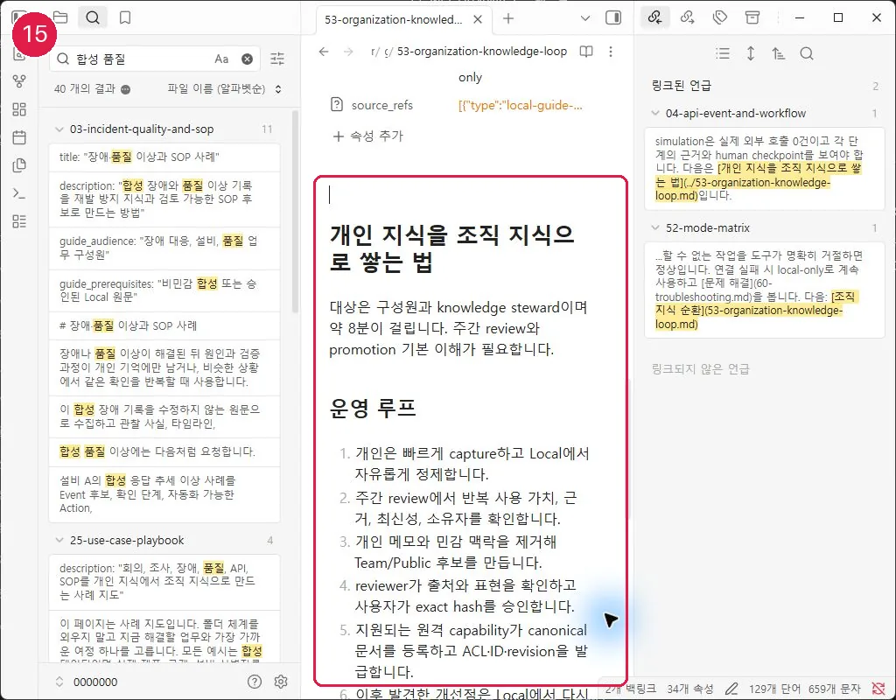

# 개인 지식을 조직 지식으로 쌓는 법

대상은 구성원과 knowledge steward이며 약 8분이 걸립니다. 주간 review와 promotion 기본 이해가 필요합니다.

## 운영 루프

1. 개인은 빠르게 capture하고 Local에서 자유롭게 정제합니다.
2. 주간 review에서 반복 사용 가치, 근거, 최신성, 소유자를 확인합니다.
3. 개인 메모와 민감 맥락을 제거해 Team/Public 후보를 만듭니다.
4. reviewer가 출처와 표현을 확인하고 사용자가 exact hash를 승인합니다.
5. 지원되는 원격 capability가 canonical 문서를 등록하고 ACL·ID·revision을 발급합니다.
6. 이후 발견한 개선점은 Local에서 다시 검증한 뒤 새 revision 후보로 순환합니다.

## 정상 결과와 실패 시 이동

개인 기록 전체가 아니라 재사용 가능한 최소 문서가 promotion되며, 원격 문서에 owner·review·출처가 남으면 정상입니다. 공유 범위나 근거가 약하면 Local에 유지합니다.

## Local/Remote 경계와 다음 여정

Git PR은 도구·가이드 개선 통로이고 실제 개인 지식 공유 통로가 아닙니다. 다음: [Promotion Package](51-promotion-package.md)
## 화면 15 — 개인 지식에서 조직 지식으로

[화면 15를 원본 크기로 열기](_media/15-organization-knowledge-loop.webp)

개인은 빠르게 수집하고 Local에서 정제합니다. 조직 공유 가치를 검토한 뒤 개인 맥락과 Local 경로를 제거하고, reviewer와 사용자가 exact hash를 승인한 candidate만 지원되는 원격 capability로 등록합니다.

다음: [MCP와 promotion 경계](50-mcp-and-promotion.md)
