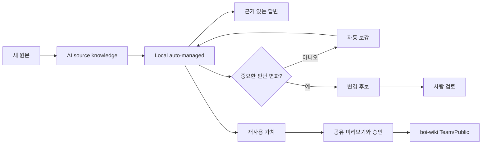
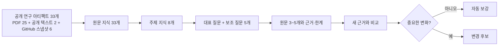
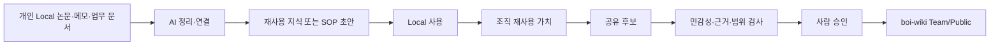
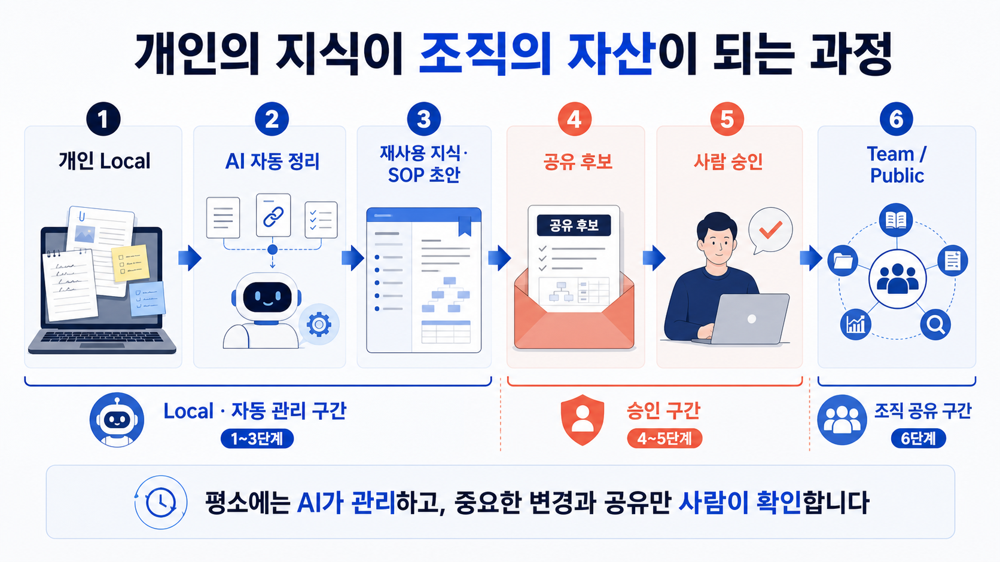
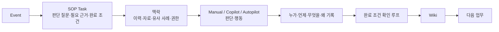

# AI Research Second Brain 방송 허브

이 자료는 **실제로 동작하는 공개 AI 연구 Second Brain**을 설명한다. 공개 연구 원문 33개를 보존하고 연결해 Local에서 답을 만들며, 이번 방송용 문서와 이미지는 오프라인으로 미리 만든 설명 자산이다. 제조 업무의 SOP/Event 적용은 별도로 제공된 비식별 조직 방향이며, 공개 연구 Vault 안에 내부 자료나 영상은 넣지 않는다.

## 실제 공개 연구 코퍼스

코퍼스는 논문만 33편인 것이 아니다. 공개 연구 아티팩트 33개는 논문 PDF 25개, 공개 텍스트 2개, GitHub 스냅샷 6개로 구성된다. 여기서 나온 41개 Local 지식 페이지는 **원문에서 확인한 33개와 여러 원문을 엮어 추론한 주제 8개**로 이루어지며 자동 관리되어 즉시 Local 답변에 쓸 수 있다. 충돌 없이 근거가 확인된 보강은 자동으로 반영한다. 사람 검토는 중요한 판단 변화, 충돌, 낮은 신뢰도, 근거가 부족한 추론, 민감 정보, 공유 범위 변경에서 필요하다. 같은 자료를 다시 넣으면 새 문서나 검토 항목을 만들지 않는다.

## 1. Local 자동 정리 흐름

아래 흐름의 요지는 새 원문이 기존 판단을 바꾸지 않으면 곧바로 Local 지식을 보강하고 답변에 재사용한다는 것이다. 중요한 판단 변화는 변경 후보로 사람에게 올린다. 재사용 가치가 생긴 내용은 별도 공유 미리보기와 승인을 거쳐 Team/Public으로 갈 수 있지만, 이 방송은 그 공유를 실행하지 않는다.

## 2. 실제 코퍼스에서 답변까지

이 흐름은 방송용 예시가 아니라 현재 공개 연구 코퍼스의 구조를 요약한다. 대표 질문과 보조 질문 5개는 각 답변마다 공개 원문 3~5개와 근거·한계를 함께 확인한다. 새 근거는 기존 지식을 자동 보강하거나, 판단에 실질적 영향을 주면 변경 후보가 된다.

## 3. 개인 Local에서 조직 지식으로

개인 논문·메모·업무 문서는 AI가 정리하고 연결해 재사용 가능한 지식 또는 SOP 초안으로 만든다. Local 사용만으로는 외부 공유가 일어나지 않는다. 조직 재사용 가치가 확인된 뒤에도 민감성·근거·범위 검사를 통과하고 사람 승인이 있어야 Team/Public 후보가 된다.

[이미지 1 원본 보기](_media/16-personal-to-organization-knowledge.png)

## 4. SOP/Event AI Native Workflow

다음은 공개 연구 시스템과 구분된 향후 조직 적용 방향이다. 업무 Event마다 SOP Task의 판단 질문, 필요한 근거, 완료 조건을 먼저 제시하고, 상황에 따라 Manual·Copilot·Autopilot 방식으로 수행한다. 수행 이유와 결과를 Wiki에 기록해 다음 업무의 맥락으로 돌려준다. 내부 제조 영상은 별도 비식별 자료이며 이 Vault나 방송 패키지에 포함하지 않는다.

[이미지 2 원본 보기](_media/17-ai-native-workflow-knowledge-loop.png)

## 화면은 선택 사항

Obsidian Canvas, Bases, Local Graph은 같은 Markdown을 보기 좋게 탐색하는 선택형 화면이다. 지식의 원문 근거·판단 경계·공유 승인 경계는 Markdown에 남으며, 이 화면들을 GraphRAG 또는 별도 지식 엔진으로 소개하지 않는다.

다음: [5분 큐시트](55-five-minute-cue-sheet.md) · [예상 Q&A](56-expected-qa.md) · [방송자 회신](57-broadcaster-reply.md)
