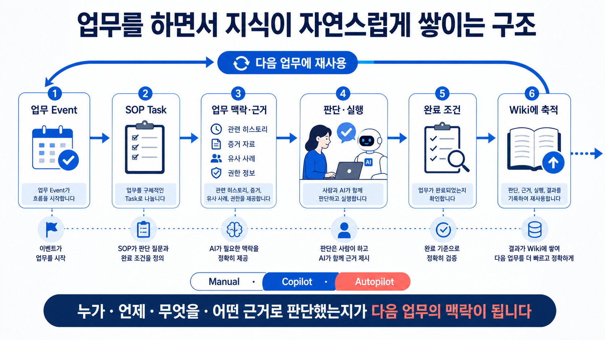

# AI Research Second Brain 방송자 회신

아래 문안은 그대로 복사해 사용할 수 있다.

> 현재 SK하이닉스 제조 업무에서 개인의 Local 세컨드 브레인에 축적된 지식과 SOP 초안을 Team/Public 지식으로 확장하고, 업무 Event에 따라 각 단계의 판단 질문·필요한 근거·완료 조건을 AI가 제공하며 수행 과정의 판단과 결과가 Wiki에 자연스럽게 축적되는 SOP 기반 AI Native Workflow의 적용 방안을 구체화하고 있습니다. 유관부서와의 PoC는 완료했으며, 이를 바탕으로 전사 확산을 목표로 Pilot 운영을 준비하고 있습니다.
>
> 이번에 소개하는 AI Research Second Brain은 시연용 모형이 아니라, 공개 연구 아티팩트 33개를 원문과 연결해 Local에서 근거 중심 답변을 만드는 실제 구현입니다. 방송용 큐시트·Q&A·두 이미지는 이 구현을 설명하기 위해 미리 생성한 오프라인 자산입니다. 반면 제조/SOP/Event 내용은 비식별화한 향후 조직 적용 방향이며, 내부 제조 영상과 개인 Local 자료는 공개 연구 Vault 및 방송 패키지에 포함하지 않습니다.

41개 Local 지식 페이지는 **원문에서 확인한 33개와 여러 원문을 엮어 추론한 주제 8개**입니다. 충돌 없이 근거가 확인된 보강은 자동으로 반영됩니다. 사람 검토는 중요한 판단 변화, 충돌, 낮은 신뢰도, 근거가 부족한 추론, 민감 정보, 공유 범위 변경에서 필요합니다. 같은 자료를 다시 넣으면 새 문서나 검토 항목을 만들지 않습니다.

개인 Local 지식은 우선 안전하게 재사용하고, 조직에 함께 쓸 가치가 확인되면 민감성·근거·범위를 확인한 뒤 사람 승인으로 Team/Public 후보를 만듭니다. 새 연구가 기존 결론을 보강하면 자동으로 연결하고, 사람 검토는 위 경계에서 진행합니다.

[이미지 2 원본 보기](_media/17-ai-native-workflow-knowledge-loop.png)

선택적으로 Canvas, Bases, Local Graph을 보여 줄 수 있지만, 이는 동일한 Markdown을 탐색하는 화면일 뿐 별도의 GraphRAG가 아니다.

다음: [방송 허브](54-broadcast-hub.md)
